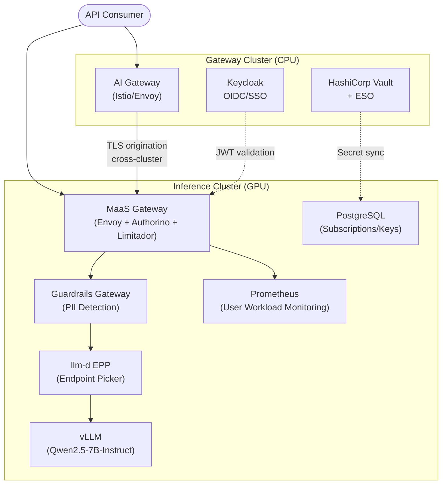
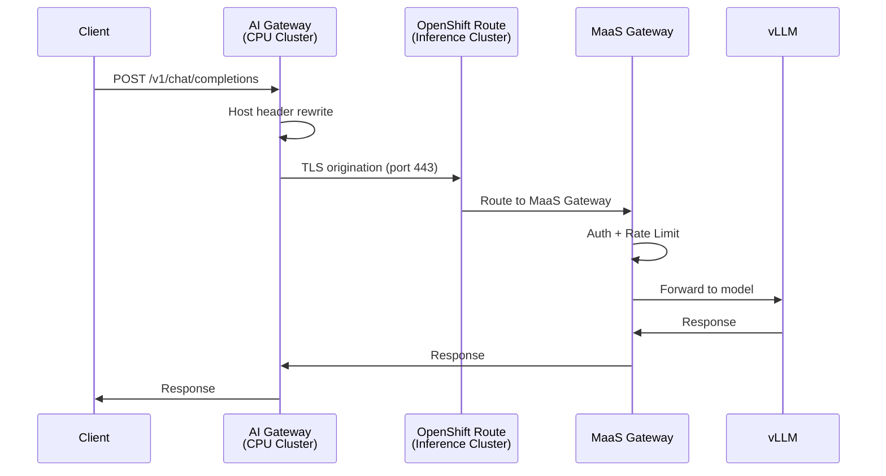
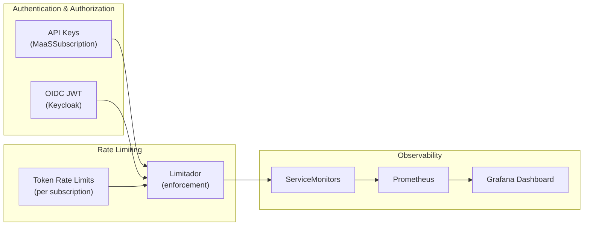

# AI Bridge (MaaS) Demo — Red Hat OpenShift AI 3.4

Complete demonstration of **Models-as-a-Service** (MaaS) governance capabilities on Red Hat OpenShift AI (RHOAI) 3.4. This repository provides a fully GitOps-managed reference implementation that validates centralized model governance, multi-cluster routing, enterprise identity federation, content safety guardrails, and observability.

## What This Demonstrates

| Capability | Description |
|-----------|-------------|
| Per-use-case authentication | API keys scoped to teams/models with instant revocation |
| Token-based rate limiting | TPM/RPM limits per subscription via Limitador |
| Tiered access | Premium / Standard / Basic tiers with independent policies |
| Usage tracking | Per-subscription metrics via Prometheus + ServiceMonitors |
| OIDC/SSO federation | Keycloak (or any IdP) JWT validation alongside API keys |
| Secret rotation | Vault + External Secrets Operator with zero-downtime sync |
| Content safety guardrails | PII detection (email, SSN, credit card) before model access |
| Multi-cluster routing | Istio gateway on CPU cluster → model on remote GPU cluster |
| Full GitOps lifecycle | Entire stack deployable declaratively from Git |

---

## Architecture



### Multi-Cluster Traffic Flow



### Governance Stack



---

## Prerequisites

- **OpenShift Container Platform** 4.19+ (two clusters recommended for multi-cluster demo)
- **Red Hat OpenShift AI (RHOAI)** 3.4 with MaaS enabled
- **Red Hat Connectivity Link (RHCL/Kuadrant)** operator (provides Authorino + Limitador)
- **GPU node** (NVIDIA) on inference cluster for model serving
- **Istio/Service Mesh** on gateway cluster (for multi-cluster routing)
- **(Optional)** Keycloak for OIDC demo
- **(Optional)** HashiCorp Vault for secret rotation demo

---

## Quick Start

### 1. Configure

```bash
cp scripts/config.env.example scripts/config.env
# Edit config.env with your cluster details
vim scripts/config.env
```

### 2. Deploy

```bash
./scripts/deploy-all.sh
```

### 3. Validate

```bash
./scripts/validate-poc.sh
```

---

## Directory Structure

```
maas-demo/
├── README.md                              # This file
├── docs/
│   ├── architecture.md                    # Detailed technical architecture
│   ├── poc-validation.md                  # PoC success criteria alignment
│   └── gaps-and-considerations.md         # Production vs demo differences
├── manifests/
│   ├── platform/                          # Platform prerequisites
│   │   ├── rhoai-instance/               # DataScienceCluster with MaaS
│   │   ├── maas-postgres/                # PostgreSQL backend
│   │   ├── monitoring-config/            # User workload monitoring
│   │   └── observability/                # ServiceMonitors + Dashboard
│   ├── model/                            # Model deployment + subscriptions
│   ├── llm-d/                            # Endpoint Picker Pod (intelligent routing)
│   ├── ai-gateway/                       # Multi-cluster Istio routing
│   ├── guardrails/                       # Content safety gateway
│   ├── oidc/                             # OIDC/SSO AuthConfig
│   └── vault-eso/                        # Vault + External Secrets
├── scripts/
│   ├── config.env.example                # Configuration template
│   ├── deploy-all.sh                     # One-shot deploy
│   ├── validate-poc.sh                   # PoC validation (all criteria)
│   └── teardown.sh                       # Clean removal
└── profiles/                             # Kustomize deployment profiles
    ├── single-cluster/                   # Everything on one cluster
    └── multi-cluster/                    # Split gateway + inference
```

---

## Deployment Profiles

### Single Cluster
Deploys the full stack on one OpenShift cluster. Multi-cluster routing resources are skipped.

```bash
./scripts/deploy-all.sh --profile single-cluster
```

### Multi-Cluster
Deploys the gateway components on one cluster and inference on another.

```bash
./scripts/deploy-all.sh --profile multi-cluster
```

---

## Key Endpoints (after deployment)

| Endpoint | URL Pattern | Auth |
|----------|-------------|------|
| MaaS Gateway | `https://<MAAS_GW_HOST>/llm-inference/<model>/v1/chat/completions` | API key or OIDC |
| Multi-cluster Gateway | `http://<AI_GW_HOST>:80/v1/chat/completions` | None (configurable) |
| Guardrails (passthrough) | `http://<GUARDRAILS_HOST>/passthrough/v1/chat/completions` | None |
| Guardrails (PII filter) | `http://<GUARDRAILS_HOST>/pii/v1/chat/completions` | None |

---

## PoC Success Criteria

This demo validates all 8 success criteria from the AI Bridge PoC:

1. **Per-use-case auth** — API keys scoped to subscriptions ✅
2. **Token rate limiting** — TPM/RPM per subscription ✅
3. **Usage tracking** — Prometheus metrics per subscription ✅
4. **Tiered access** — 3 tiers with independent limits ✅
5. **OIDC/SSO** — Keycloak JWT + role-based access ✅
6. **Observability** — Dashboards + ServiceMonitors ✅
7. **API compatibility** — Standard OpenAI format ✅
8. **Secret rotation** — Vault + ESO zero-downtime sync ✅

See [docs/poc-validation.md](docs/poc-validation.md) for detailed evidence.

---

## License

Apache License 2.0
