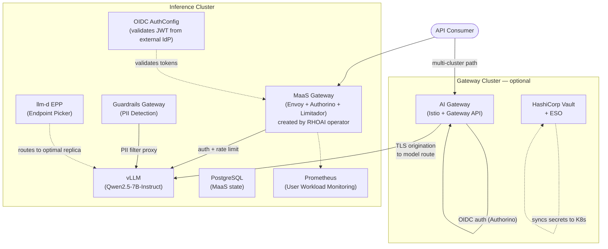
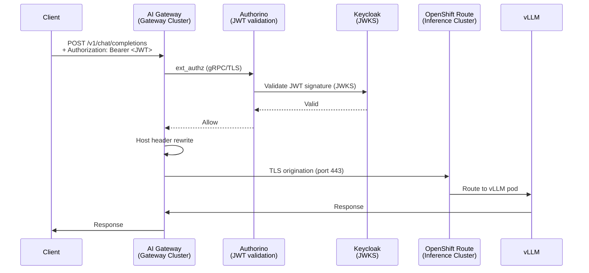
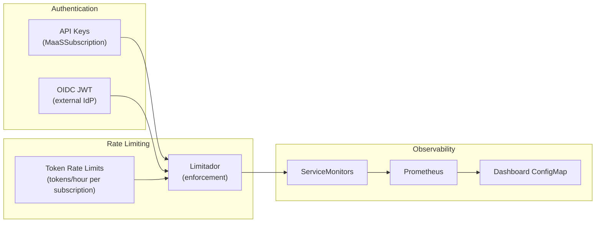

# AI Bridge (MaaS) Demo — Red Hat OpenShift AI 3.4

Demonstration of **Models-as-a-Service** (MaaS) governance capabilities on Red Hat OpenShift AI (RHOAI) 3.4. This repository provides manifests, scripts, and documentation to deploy and validate centralized model governance, multi-cluster routing, enterprise identity federation, content safety guardrails, and observability.

## What This Demonstrates

| Capability | Description |
|-----------|-------------|
| Per-use-case authentication | API keys scoped to teams/models via MaaSSubscription |
| Token-based rate limiting | Per-subscription token limits (tokens/hour) via Limitador |
| Tiered access | Premium / Standard / Basic tiers with independent policies |
| Usage tracking | Per-subscription metrics via Prometheus + ServiceMonitors |
| OIDC/SSO federation | Any OIDC IdP JWT validation alongside API keys (BYO Keycloak/Okta/Azure AD) |
| Secret rotation pattern | Vault + External Secrets Operator demonstrating zero-downtime K8s Secret sync |
| Content safety guardrails | PII detection (email, SSN, credit card regex) before model access |
| Multi-cluster routing | Istio gateway with OIDC auth → TLS to model on remote GPU cluster |

---

## Architecture



### Multi-Cluster Traffic Flow

The AI Gateway enforces OIDC/JWT authentication (via Authorino + Keycloak on the gateway cluster) before forwarding requests to the model on the inference cluster. Unauthenticated requests receive 401.



### Governance Stack (MaaS Direct Access)

When clients access the MaaS gateway directly, requests pass through Authorino (auth) and Limitador (rate limiting):



---

## Prerequisites

These must be installed on your cluster(s) **before** running `deploy-all.sh`:

| Prerequisite | Required for | Installed by this repo? |
|--------------|-------------|------------------------|
| OpenShift 4.19+ | Platform | No |
| RHOAI 3.4 operator | MaaS gateway, model serving | No (DSC manifest only) |
| RHCL/Kuadrant operator | Authorino + Limitador | No |
| NVIDIA GPU Operator | Model inference (both clusters have GPUs) | No |
| Istio/Service Mesh | Multi-cluster routing | No |
| OIDC provider (Keycloak, Okta, etc.) | OIDC demo | No — bring your own |

The scripts deploy the **application-level** resources (model, subscriptions, guardrails, Vault, ESO, observability) but assume the platform operators are already present.

---

## Quick Start

### 0. Platform Setup (one-time)

Ensure the following operators are installed on your inference cluster:
- Red Hat OpenShift AI 3.4
- Red Hat Connectivity Link (Kuadrant)
- NVIDIA GPU Operator

For multi-cluster, also install Istio/Service Mesh on the gateway cluster.

### 1. Configure

```bash
cp scripts/config.env.example scripts/config.env
# Edit config.env with your cluster details — all REPLACE_WITH_* values must be filled
vim scripts/config.env
```

Key values to fill:
- `CTX_INFERENCE` / `CTX_GATEWAY` — your `oc` context names
- `REMOTE_MODEL_HOSTNAME` — the model's OpenShift Route hostname (for multi-cluster)
- `VLLM_SERVICE` — the KServe workload service (e.g., `qwen25-7b-instruct-kserve-workload-svc.llm-inference.svc:8000`)
- `KEYCLOAK_HOST` — your OIDC provider hostname (if using OIDC)

### 2. Deploy

```bash
./scripts/deploy-all.sh
```

### 3. Validate

```bash
./scripts/validate-poc.sh
```

---

## Directory Structure

```
maas-demo/
├── README.md                              # This file
├── docs/
│   ├── architecture.md                    # Detailed technical architecture
│   ├── poc-validation.md                  # PoC success criteria alignment
│   └── gaps-and-considerations.md         # Production vs demo differences
├── manifests/
│   ├── platform/                          # Platform-level resources
│   │   ├── rhoai-instance/               # DataScienceCluster with MaaS enabled
│   │   ├── maas-postgres/                # PostgreSQL (MaaS state store)
│   │   ├── monitoring-config/            # User workload monitoring
│   │   └── observability/                # ServiceMonitors + Dashboard
│   ├── model/                            # Model deployment + subscriptions
│   ├── llm-d/                            # Endpoint Picker Pod (intelligent routing)
│   ├── ai-gateway/                       # Multi-cluster Istio routing + OIDC auth
│   ├── guardrails/                       # Content safety gateway (PII regex)
│   ├── oidc/                             # OIDC AuthConfig (BYO IdP)
│   └── vault-eso/                        # Vault + External Secrets (pattern demo)
├── scripts/
│   ├── config.env.example                # Configuration template
│   ├── deploy-all.sh                     # Deployment script (imperative ordering)
│   ├── validate-poc.sh                   # PoC validation (all criteria)
│   └── teardown.sh                       # Clean removal
└── profiles/                             # Kustomize overlays (for ArgoCD users)
    ├── single-cluster/
    └── multi-cluster/
```

---

## Deployment Profiles

### Single Cluster
Deploys the full stack on one OpenShift cluster. Multi-cluster routing resources are skipped.

```bash
./scripts/deploy-all.sh single-cluster
# or: ./scripts/deploy-all.sh --profile single-cluster
```

### Multi-Cluster
Deploys the gateway components on one cluster and inference on another.

```bash
./scripts/deploy-all.sh multi-cluster
# or: ./scripts/deploy-all.sh --profile multi-cluster
```

> **Note:** The `profiles/` directory provides Kustomize overlays for ArgoCD/GitOps users.
> The scripts handle ordering imperatively and are recommended for initial setup.
> Profiles contain `REPLACE_WITH_*` placeholders that must be substituted before use with `oc apply -k`.

---

## Key Endpoints (after deployment)

| Endpoint | URL Pattern | Auth | Notes |
|----------|-------------|------|-------|
| MaaS Gateway | `https://<MAAS_GW_HOST>/llm-inference/<model>/v1/chat/completions` | API key or OIDC | Created by RHOAI operator |
| Multi-cluster Gateway | `http://<AI_GW_HOST>:80/v1/chat/completions` | OIDC JWT | Keycloak token required; Authorino validates locally |
| Guardrails (passthrough) | `http://<GUARDRAILS_HOST>/passthrough/v1/chat/completions` | None | No PII filtering |
| Guardrails (PII filter) | `http://<GUARDRAILS_HOST>/pii/v1/chat/completions` | None | Regex PII detection |

---

## License

Apache License 2.0
