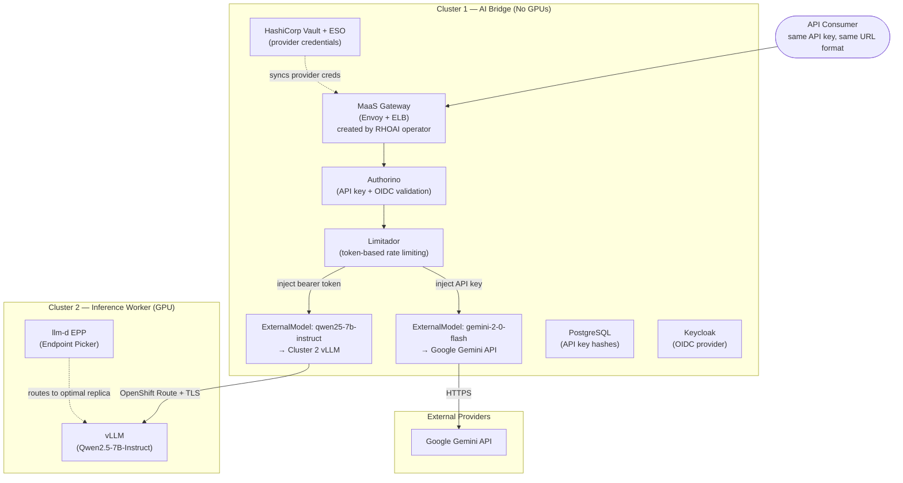
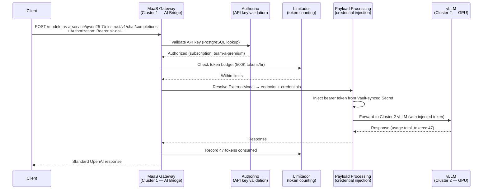
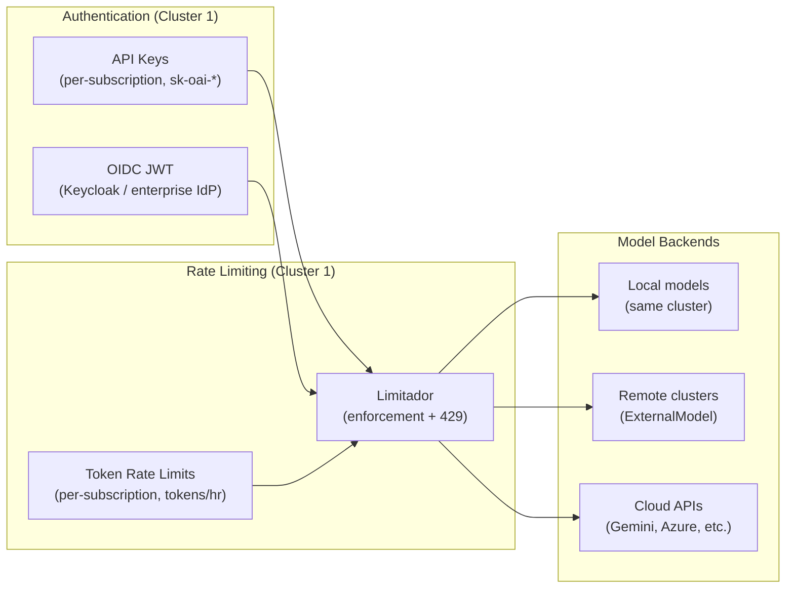

# AI Bridge (MaaS) Demo — Red Hat OpenShift AI 3.4

Demonstration of **Models-as-a-Service** (MaaS) governance capabilities on Red Hat OpenShift AI (RHOAI) 3.4. This repository provides manifests, scripts, and documentation to deploy and validate centralized model governance, multi-cluster routing, enterprise identity federation, content safety guardrails, and observability.

## What This Demonstrates

| Capability | Description |
|-----------|-------------|
| Per-use-case authentication | API keys scoped to teams/models via MaaSSubscription |
| Token-based rate limiting | Per-subscription token limits (tokens/hour) via Limitador |
| Tiered access | Premium / Standard / Basic tiers with independent policies |
| Usage tracking | Per-subscription metrics via Prometheus + ServiceMonitors |
| OIDC/SSO federation | Any OIDC IdP JWT validation alongside API keys (BYO Keycloak/Okta/Azure AD) |
| Secret rotation pattern | Vault + External Secrets Operator demonstrating zero-downtime K8s Secret sync |
| Content safety guardrails | PII detection (email, SSN, credit card regex) before model access |
| Multi-cluster routing | ExternalModel CRs on AI Bridge route to models on remote clusters + cloud APIs |

---

## Architecture



### Multi-Cluster Traffic Flow (ExternalModel)

All consumer traffic enters through the MaaS gateway on Cluster 1 (AI Bridge). The gateway validates API keys, enforces rate limits, then injects provider credentials and routes to the appropriate backend. Consumers never see or handle provider credentials.

> **llm-d Status:** The dashed line from llm-d EPP indicates it's deployed but not yet in the active traffic path. llm-d provides intelligent replica selection when multiple vLLM replicas exist. Full integration requires Gateway API Inference Extension support (see `docs/architecture.md` for details).



### Governance Stack



---

## Prerequisites

These must be installed on your cluster(s) **before** running `deploy-all.sh`:

| Prerequisite | Cluster 1 (AI Bridge) | Cluster 2 (Inference Worker) |
|--------------|:---:|:---:|
| OpenShift 4.18+ | Yes | Yes |
| RHOAI 3.4 operator | Yes (MaaS governance) | Yes (model serving) |
| RHCL/Kuadrant operator | Yes (Authorino + Limitador) | No |
| NVIDIA GPU Operator | No (no GPUs needed) | Yes |
| Service Mesh 3 | Yes (Gateway API provider) | No |
| OIDC provider (Keycloak, etc.) | Yes | No |

The scripts deploy the **application-level** resources (model, subscriptions, ExternalModels, Vault, ESO, observability) but assume the platform operators are already present.

---

## Quick Start

### 0. Platform Setup (one-time)

**Cluster 1 (AI Bridge):**
- Red Hat OpenShift AI 3.4 (with `modelsAsService: Managed`)
- Red Hat Connectivity Link (Kuadrant)
- Service Mesh 3 (for Gateway API)
- OIDC provider (Keycloak deployed or external)

**Cluster 2 (Inference Worker):**
- Red Hat OpenShift AI 3.4 (for KServe/vLLM)
- NVIDIA GPU Operator

### 1. Configure

```bash
cp scripts/config.env.example scripts/config.env
# Edit config.env with your cluster details — all REPLACE_WITH_* values must be filled
vim scripts/config.env
```

Key values to fill:
- `CTX_AI_BRIDGE` / `CTX_INFERENCE` — your `oc` context names for Cluster 1 / Cluster 2
- `MAAS_GW_HOST` — the MaaS gateway ELB hostname (auto-provisioned on Cluster 1)
- `INFERENCE_CLUSTER_ROUTE` — the model's OpenShift Route hostname on Cluster 2 (used by ExternalModel)
- `KEYCLOAK_HOST` — your OIDC provider hostname (Keycloak on Cluster 1)
- `GEMINI_API_KEY` — Google Gemini API key (stored in Vault, never in Git)

### 2. Deploy

```bash
./scripts/deploy-all.sh
```

### 3. Validate

```bash
./scripts/validate-poc.sh
```

---

## Directory Structure

```
maas-demo/
├── README.md                              # This file
├── docs/
│   ├── architecture.md                    # Detailed technical architecture
│   ├── poc-validation.md                  # PoC success criteria alignment
│   └── gaps-and-considerations.md         # Production vs demo differences
├── manifests/
│   ├── platform/                          # Platform-level resources
│   │   ├── rhoai-instance/               # DataScienceCluster with MaaS enabled
│   │   ├── maas-postgres/                # PostgreSQL (MaaS state store)
│   │   ├── monitoring-config/            # User workload monitoring
│   │   └── observability/                # ServiceMonitors + Dashboard
│   ├── maas-governance/                   # MaaS Tenant, Subscriptions, AuthPolicies (GitOps)
│   ├── model/                            # Model deployment (for inference cluster)
│   ├── external-models/                  # ExternalModel CRs + provider credentials
│   ├── llm-d/                            # Endpoint Picker Pod (intelligent routing)
│   ├── ai-gateway/                       # Multi-cluster Istio routing + OIDC auth
│   ├── guardrails/                       # Content safety gateway (PII regex)
│   ├── oidc/                             # OIDC AuthConfig (BYO IdP)
│   └── vault-eso/                        # Vault + External Secrets (pattern demo)
├── scripts/
│   ├── config.env.example                # Configuration template
│   ├── deploy-all.sh                     # Deployment script (imperative ordering)
│   ├── validate-poc.sh                   # PoC validation (all criteria)
│   └── teardown.sh                       # Clean removal
└── profiles/                             # Kustomize overlays (for ArgoCD users)
    ├── single-cluster/
    └── multi-cluster/
```

---

## Deployment Profiles

### Single Cluster
Deploys the full stack on one OpenShift cluster. Multi-cluster routing resources are skipped.

```bash
./scripts/deploy-all.sh single-cluster
# or: ./scripts/deploy-all.sh --profile single-cluster
```

### Multi-Cluster (AI Bridge + Inference Worker)
Deploys MaaS governance + ExternalModels on Cluster 1 (AI Bridge) and model serving on Cluster 2 (Inference Worker).

```bash
./scripts/deploy-all.sh multi-cluster
# or: ./scripts/deploy-all.sh --profile multi-cluster
```

> **Note:** The `profiles/` directory provides Kustomize overlays for ArgoCD/GitOps users.
> The scripts handle ordering imperatively and are recommended for initial setup.
> Profiles contain `REPLACE_WITH_*` placeholders that must be substituted before use with `oc apply -k`.

---

## Key Endpoints (after deployment)

| Endpoint | URL Pattern | Auth | Notes |
|----------|-------------|------|-------|
| MaaS Gateway (ExternalModel) | `https://<MAAS_GW_HOST>/models-as-a-service/<model>/v1/chat/completions` | API key (`sk-oai-*`) | Primary path — governed access to remote/external models |
| MaaS Gateway (local model) | `https://<MAAS_GW_HOST>/llm-inference/<model>/v1/chat/completions` | API key (`sk-oai-*`) | Only if model runs on same cluster as MaaS |
| Guardrails (passthrough) | `http://<GUARDRAILS_HOST>/passthrough/v1/chat/completions` | None | No PII filtering |
| Guardrails (PII filter) | `http://<GUARDRAILS_HOST>/pii/v1/chat/completions` | None | Regex PII detection |

---

## License

Apache License 2.0
