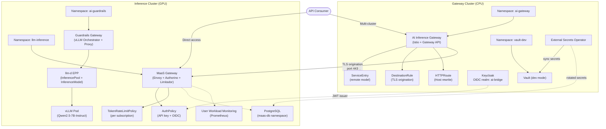
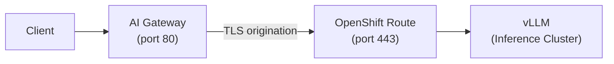

# AI Bridge (MaaS) Demo — Technical Architecture

## Executive Summary

This document describes the AI Bridge demonstration environment built on Red Hat OpenShift AI (RHOAI) 3.4. The environment validates the Models-as-a-Service (MaaS) capabilities across two OpenShift clusters, demonstrating centralized model governance, multi-cluster routing, enterprise identity federation, content safety guardrails, and GitOps-driven lifecycle management.

The demo is structured to align with a PoC validation plan covering Stages A (Foundation), B (Governance & Multi-Tenancy), and C (Enterprise Integration).

---

## Architecture Overview



---

## Platform Versions

| Component | Version | Cluster |
|-----------|---------|---------|
| OpenShift Container Platform | 4.19+ | Both |
| Red Hat OpenShift AI (RHOAI) | 3.4.0 | Both |
| Red Hat Connectivity Link (RHCL/Kuadrant) | 1.3.x | Both |
| Authorino | 1.3.0 | Both |
| Limitador | Managed by RHCL | Both |
| NVIDIA GPU Operator | 25.x | Inference cluster |
| Service Mesh (Istio) | 3.x | Gateway cluster |
| Keycloak (RHBK) | Operator-managed | Gateway cluster |
| HashiCorp Vault | 1.17 (dev mode) | Gateway cluster |
| External Secrets Operator | 1.1.0 (Red Hat) | Gateway cluster |

---

## Demonstrated Capabilities

### Stage A: AI Bridge Foundation

#### A1. MaaS Enablement

**What it is:** Models-as-a-Service provides a centralized governance layer for LLM access. It deploys an API gateway (Envoy + Authorino + Limitador) in front of model endpoints, handling authentication, authorization, rate limiting, and usage tracking.

**What's deployed:**
- `DataScienceCluster` with `modelsAsService: Managed`
- PostgreSQL backend storing subscriptions, API keys, and usage data
- `maas-default-gateway` Gateway resource (Envoy-based, TLS-terminated)
- Authorino handling ext-auth decisions via gRPC

**Demo flow:**
1. Admin creates a subscription for a team
2. Engineer generates an API key scoped to that subscription
3. Requests to the MaaS endpoint are authenticated, rate-limited, and metered
4. Usage data is recorded per-subscription in PostgreSQL and exposed via Prometheus

#### A2. Model Serving (Qwen2.5-7B-Instruct)

**What it is:** A production-grade LLM served via vLLM with GPU acceleration, exposed through the AI Bridge as an OpenAI-compatible endpoint.

**What's deployed:**
- `LLMInferenceService` CR managing the vLLM pod
- PVC with model weights downloaded from HuggingFace
- KServe runtime serving on port 8000 (HTTPS)
- OpenAI-compatible API (`/v1/chat/completions`, `/v1/models`)

**Validation:**
```bash
curl -H "Authorization: Bearer <api-key>" \
  https://<MAAS_GW_HOST>/llm-inference/qwen25-7b-instruct/v1/chat/completions \
  -d '{"model":"qwen25-7b-instruct","messages":[{"role":"user","content":"Hello"}]}'
```

#### A3. llm-d Intelligent Routing

**What it is:** The llm-d Endpoint Picker Pod provides inference-aware request routing using the Gateway API `InferencePool` and `InferenceModel` CRDs. It routes requests to the optimal vLLM replica based on load, KV cache utilization, and model availability.

**What's deployed:**
- `InferencePool` (GA API: `inference.networking.x-k8s.io/v1`)
- `InferenceModel` linking model name to the pool
- EPP Deployment with proper RBAC for the inference API group

#### A4. Multi-Cluster Routing

**What it is:** A centralized AI Gateway on one cluster (CPU) routes inference requests to model endpoints on a remote GPU cluster via Istio service mesh, providing a single entry point for consumers regardless of where models are physically deployed.

**What's deployed (gateway cluster):**
- Istio `Gateway` (listening on port 80 HTTP)
- `HTTPRoute` with Host header rewrite for the remote cluster
- `ServiceEntry` declaring the remote model endpoint as an external mesh service
- `DestinationRule` configuring TLS origination (SIMPLE mode)
- `ExternalName` Service pointing to the remote cluster's route hostname

**Traffic flow:**



---

### Stage B: Governance & Multi-Tenancy

#### B1. Per-Use-Case Authentication (API Keys + Subscriptions)

Each team/use-case gets its own subscription with independently managed API keys. Keys are scoped to specific models and can be created, rotated, and revoked instantly.

**What's deployed:**
- `MaaSSubscription` CRs for three teams (premium, standard, basic tiers)
- API keys stored in PostgreSQL, validated by Authorino on each request
- Revocation takes effect immediately (no cache)

#### B2. Token-Based Rate Limiting

Rate limits enforced per-subscription based on tokens-per-minute (TPM). Token-based limiting accounts for prompt size, preventing large-prompt requests from consuming disproportionate capacity.

**What's deployed:**
- `tokenRateLimits` configured per subscription tier
- Limitador enforcing counters per subscription ID
- Prometheus metrics for rate limit events

**Tier configuration:**
- Premium: 500,000 tokens/hr
- Standard: 100,000 tokens/hr
- Basic: 50,000 tokens/hr

#### B3. Tiered Access

Multiple subscription tiers with independent rate limit policies. Each tier gets its own throughput allocation and priority level.

#### B4. Usage Tracking

Per-subscription request count and token usage visible via Prometheus metrics.

**What's deployed:**
- `ServiceMonitor` for Authorino metrics
- `ServiceMonitor` for Limitador metrics
- Grafana dashboard ConfigMap with panels for requests, tokens, rate limits, latency

---

### Stage C: Enterprise Integration

#### C1. OIDC / SSO Integration

The AI Bridge federates with an enterprise identity provider (Keycloak or any OIDC-compliant IdP) to support token-based authentication alongside API keys.

**What's deployed (in this repo):**
- Authorino `AuthConfig` validating JWTs from the configured OIDC issuer (`manifests/oidc/authconfig.yaml`)
- Dual authentication: both API keys and OIDC Bearer tokens accepted

**External prerequisite (bring your own):**
- Keycloak (or any OIDC provider) with:
  - A realm (e.g., `ai-bridge`)
  - An OIDC client (`ai-bridge-gateway`) with `client_credentials` grant enabled
  - Roles: `ai-admin`, `ai-engineer` assigned to users
- Set `KEYCLOAK_HOST` in `scripts/config.env` to your IdP's hostname
- For Keycloak on OpenShift, install the RHBK operator and create a `Keycloak` CR + `KeycloakRealmImport`

#### C2. Secret Management (External Secrets Operator + Vault)

Demonstrates zero-downtime credential rotation by syncing secrets from HashiCorp Vault to Kubernetes Secrets via the External Secrets Operator.

**What's deployed:**
- HashiCorp Vault (dev mode) with KV v2 secrets engine
- Vault secrets: `ai-bridge/api-keys`, `ai-bridge/db-credentials`
- Red Hat External Secrets Operator
- `SecretStore` pointing to Vault with token auth
- `ExternalSecret` resources syncing Vault → K8s Secrets (30-second refresh)

#### C3. Observability

Live dashboards showing inference metrics per subscription with rate limit event visibility.

**Key metrics:**
- `authorino_auth_server_evaluator_total` — auth decisions per subscription
- `limitador_counter_value` — current rate limit counter values
- `limitador_requests_total` — total requests processed
- Standard vLLM metrics: TTFT, throughput, queue depth

#### C4. Guardrails Gateway (Content Safety)

An inline content safety filter that inspects requests and responses for PII, prompt injection, and other policy violations.

**What's deployed:**
- vLLM Orchestrator Gateway (Rust-based, port 8090)
- Orchestrator proxy sidecar (Python, port 8085) connecting to the vLLM backend
- Regex-based detectors for: email, SSN, credit card numbers
- Two endpoints:
  - `/passthrough/v1/chat/completions` — no detection, direct proxy
  - `/pii/v1/chat/completions` — PII detection on input and output

---

## Key Technical Decisions

| Decision | Rationale |
|----------|-----------|
| PVC-based model download (not image pull) | HuggingFace download is more portable across environments |
| Self-signed TLS for MaaS gateway | Production should use cert-manager with proper CA |
| Vault dev mode (in-memory) | Demo simplicity; production uses HA Vault with persistent storage |
| Python orchestrator proxy for guardrails | Lightweight proxy demonstrates the architecture pattern |
| Host header rewrite in HTTPRoute | Required for Istio TLS origination to match remote route hostname |

---

## Endpoints Reference

| Endpoint | URL Pattern | Auth |
|----------|-------------|------|
| MaaS Gateway (inference) | `https://<MAAS_GW_HOST>/llm-inference/<model>/v1/chat/completions` | API key or OIDC token |
| Multi-cluster Gateway | `http://<AI_GW_HOST>:80/v1/chat/completions` | None (configurable) |
| Guardrails (passthrough) | `http://<GUARDRAILS_HOST>/passthrough/v1/chat/completions` | None |
| Guardrails (PII filter) | `http://<GUARDRAILS_HOST>/pii/v1/chat/completions` | None |
| Keycloak OIDC | `https://<KEYCLOAK_HOST>/realms/ai-bridge` | admin/password |
| Vault API | `http://vault.vault-dev.svc:8200` (cluster-internal) | Token |

---

## Prerequisites for Replication

To replicate this in any environment:

1. **RHOAI 3.4** images available (mirrored if disconnected)
2. **RHCL operator** installed (Kuadrant/Authorino/Limitador)
3. **PostgreSQL** instance for MaaS backend
4. **GPU Operator** with compatible drivers
5. **cert-manager** for production TLS
6. **Enterprise IdP** (Okta, Azure AD, Keycloak) for OIDC federation
7. **HashiCorp Vault** instance for secret management
8. **Network connectivity** between clusters for multi-cluster routing
