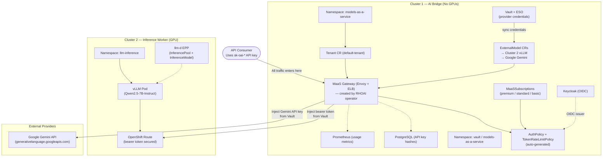
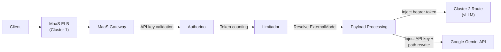

# AI Bridge (MaaS) Demo — Technical Architecture

## Executive Summary

This document describes the AI Bridge demonstration environment built on Red Hat OpenShift AI (RHOAI) 3.4. The environment validates the Models-as-a-Service (MaaS) capabilities using two OpenShift clusters:

- **Cluster 1 (AI Bridge)**: Centralized MaaS governance — authentication, rate limiting, usage tracking, ExternalModel routing. This cluster CAN serve local models (e.g., `gemma2-9b-fp8` for demo purposes) but the primary pattern is routing to external backends.
- **Cluster 2 (Inference Worker)**: GPU cluster running vLLM (Qwen2.5-7B-Instruct). Exposed via OpenShift Route. All governance is centralized on Cluster 1 via ExternalModel.

The demo also routes to **Google Gemini** as an external provider via `ExternalModel`, demonstrating that the AI Bridge can govern any OpenAI-compatible backend regardless of where it runs.

---

## Architecture Overview



**Single governance path:** All consumer traffic enters through the MaaS gateway on Cluster 1. The gateway validates API keys, enforces per-subscription token rate limits, then injects the appropriate provider credential and routes to the backend. Consumers never see or handle provider credentials.

> **Note on llm-d:** The dashed line from llm-d EPP to vLLM indicates that llm-d is deployed but not yet in the active traffic path. Currently, traffic routes directly to vLLM via the OpenShift Route. When Gateway API Inference Extension is fully supported, traffic will flow: MaaS Gateway → llm-d → optimal vLLM replica.

**ExternalModel pattern:** The `ExternalModel` CR on Cluster 1 declares a backend (hostname + provider type + credential reference). The MaaS `payload-processing` plugin resolves the model, injects credentials from the referenced Secret, and forwards. Adding a new backend = one `ExternalModel` CR + one Secret.

---

## Platform Versions

| Component | Cluster 1 (AI Bridge) | Cluster 2 (Inference Worker) |
|-----------|:---:|:---:|
| OpenShift Container Platform | 4.18+ | 4.18+ |
| Red Hat OpenShift AI (RHOAI) | 3.4.0 (MaaS governance) | 3.4.0 (model serving) |
| Red Hat Connectivity Link (RHCL/Kuadrant) | 1.2+ (Authorino + Limitador) | Not required |
| Service Mesh 3 (Sail) | Yes (Gateway API provider) | Not required |
| NVIDIA GPU Operator | Not required (no GPUs) | 25.x |
| HashiCorp Vault + ESO | Yes (provider credentials) | Not required |
| Keycloak (OIDC) | Yes | Not required |

---

## Demonstrated Capabilities

### Stage A: AI Bridge Foundation

#### A1. MaaS Enablement

**What it is:** Models-as-a-Service provides a centralized governance layer for LLM access. It deploys an API gateway (Envoy + Authorino + Limitador) in front of model endpoints, handling authentication, authorization, rate limiting, and usage tracking.

**CRD Model (all `maas.opendatahub.io/v1alpha1`):**

| CRD | Namespace | Purpose |
|-----|-----------|---------|
| `Tenant` | models-as-a-service | Singleton anchor — gateway ref, key expiration policy, telemetry |
| `MaaSModelRef` | models-as-a-service | Registers model for governance (local or ExternalModel) |
| `MaaSAuthPolicy` | models-as-a-service | Defines group/user access to models |
| `MaaSSubscription` | models-as-a-service | Per-team quotas with inline `tokenRateLimits` |
| `ExternalModel` | models-as-a-service | (Tech Preview) Routes to external/remote providers |

**Auto-generated resources (by MaaS controller — NOT user-managed):**

| Generated Resource | API Version | Purpose |
|--------------------|-------------|---------|
| `HTTPRoute` | gateway.networking.k8s.io/v1 | Routes traffic to model via gateway |
| `AuthPolicy` | kuadrant.io/v1beta2 | API key validation via Authorino |
| `TokenRateLimitPolicy` | kuadrant.io/v1alpha1 | Per-subscription token metering via Limitador |

**What's deployed:**
- `DataScienceCluster` with `modelsAsService: Managed`
- `Tenant` CR (`default-tenant`) in `models-as-a-service` namespace
- PostgreSQL backend (`maas-db` namespace) storing MaaS internal state (subscriptions, key hashes, usage)
- `maas-default-gateway` Gateway resource in `openshift-ingress` (with annotations: `opendatahub.io/managed: "false"`, `security.opendatahub.io/authorino-tls-bootstrap: "true"`)
- Authorino handling ext-auth decisions via gRPC

**Demo flow:**
1. Admin creates a `Tenant` (once) → anchors MaaS to the gateway
2. Admin creates `MaaSSubscription` + `MaaSAuthPolicy` for a team
3. Engineer generates an API key (prefix `sk-oai-`) scoped to that subscription
4. Requests to the MaaS endpoint are authenticated, rate-limited, and metered
5. MaaS controller auto-generates Kuadrant `AuthPolicy` + `TokenRateLimitPolicy`
4. Usage data is recorded per-subscription and exposed via Prometheus

#### A2. Model Serving (Qwen2.5-7B-Instruct)

**What it is:** A production-grade LLM served via vLLM with GPU acceleration, exposed through the AI Bridge as an OpenAI-compatible endpoint.

**What's deployed:**
- `LLMInferenceService` CR managing the vLLM pod
- PVC with model weights downloaded from HuggingFace
- KServe runtime serving on port 8000 (HTTPS)
- OpenAI-compatible API (`/v1/chat/completions`, `/v1/models`)

**Validation:**
```bash
# Via AI Bridge (ExternalModel path — primary)
curl -H "Authorization: Bearer <api-key>" \
  https://<MAAS_GW_HOST>/models-as-a-service/qwen25-7b-instruct/v1/chat/completions \
  -d '{"model":"qwen25-7b-instruct","messages":[{"role":"user","content":"Hello"}]}'
```

#### A3. llm-d Intelligent Routing

**What it is:** The llm-d Endpoint Picker Pod (EPP) provides inference-aware request routing using the Gateway API `InferencePool` and `InferenceModel` CRDs. When multiple vLLM replicas exist, llm-d routes requests to the optimal replica based on load, KV cache utilization, and queue depth.

**Deployment Status:**
- `InferencePool` (API: `inference.networking.k8s.io/v1` — GA) ✓
- `InferenceModel` (API: `inference.networking.x-k8s.io/v1alpha2`) ✓
- EPP Deployment with RBAC for both API groups ✓
- llm-d is healthy and tracking vLLM pods ✓

**Integration Status:**
> **Current limitation:** The OpenShift gateway controller (v1) does not yet support `InferencePool` as an HTTPRoute backendRef. The error `referencing unsupported backendRef: group "inference.networking.k8s.io" kind "InferencePool"` indicates that while the Gateway API Inference Extension is enabled (`ENABLE_GATEWAY_API_INFERENCE_EXTENSION=true`), the controller-side support is incomplete.
>
> **Current behavior:** Traffic from AI Bridge routes directly to vLLM via OpenShift Route, bypassing llm-d.
>
> **Target behavior (when fully integrated):** AI Bridge → llm-d HTTPRoute → InferencePool → optimal vLLM replica.
>
> This is expected to be resolved in a future RHOAI release with full Gateway API Inference Extension support.

**What llm-d provides (when integrated):**
- Load-aware routing across vLLM replicas
- KV cache utilization-based scheduling
- Queue depth monitoring for backpressure
- Metrics collection from inference pods

#### A4. Multi-Cluster Routing via ExternalModel

**What it is:** The AI Bridge (Cluster 1) uses `ExternalModel` CRs to route governed traffic to models running on remote clusters or external cloud APIs. This is the **primary** multi-cluster pattern — centralized governance with distributed inference.

**What's deployed (Cluster 1 — AI Bridge):**
- `ExternalModel` CR: `qwen25-7b-instruct` → Cluster 2's vLLM (via OpenShift Route)
- `ExternalModel` CR: `gemini-2-0-flash` → Google Gemini API
- `MaaSModelRef` for each ExternalModel (status: Ready)
- Provider credentials synced from Vault via ESO (labeled `inference.networking.k8s.io/bbr-managed: "true"`)
- `EnvoyFilter` (Lua) for Gemini path rewrite (`/v1/` → `/v1beta/openai/`)

**Traffic flow:**



**Key advantage:** Adding a new backend is a single `ExternalModel` CR + one Secret. Zero consumer-side changes — same gateway URL, same API keys, same rate limits.

> **Legacy note:** An older Istio-based gateway approach (ServiceEntry + DestinationRule) is preserved in `manifests/ai-gateway/` for reference. It is superseded by the ExternalModel pattern which routes through MaaS governance.

---

### Stage B: Governance & Multi-Tenancy

#### B1. Per-Use-Case Authentication (API Keys + Subscriptions)

Each team/use-case gets its own subscription with independently managed API keys. Keys use the `sk-oai-` prefix, are scoped to specific models, and can be created, rotated, and revoked instantly.

**What's deployed:**
- `MaaSSubscription` CRs for three teams (premium, standard, basic tiers)
- `MaaSAuthPolicy` defining which groups can access which models
- API keys managed via RHOAI Dashboard/MaaS API, SHA-256 hashes stored in PostgreSQL, validated by Authorino on each request
- Key expiration controlled by `Tenant.spec.apiKeys.maxExpirationDays` (default 90)

**API key properties:**
- Prefix: `sk-oai-`
- Expiration: 1–365 days (max controlled by Tenant)
- Group snapshot: captures user's groups at creation time
- Revocation: permanent and instant (no cache delay)

#### B2. Token-Based Rate Limiting

Rate limits enforced per-subscription using **tokens per hour**. Token-based limiting accounts for prompt size, preventing large-prompt requests from consuming disproportionate capacity. The MaaS controller auto-generates `TokenRateLimitPolicy` (kuadrant.io/v1alpha1) resources — users only configure the inline `tokenRateLimits` on their subscriptions.

**How it works:**
1. User configures `spec.modelRefs[].tokenRateLimits` on `MaaSSubscription`
2. MaaS controller generates `TokenRateLimitPolicy` targeting the gateway
3. Limitador intercepts responses, extracts `total_tokens` from OpenAI `usage` field
4. Counter keyed by `auth.identity.userid` accumulates per window
5. HTTP 429 returned when limit exceeded; counter resets on window expiry

**What's deployed:**
- `tokenRateLimits` configured per subscription tier in `MaaSSubscription` CRs
- `TokenRateLimitPolicy` auto-generated by MaaS controller (kuadrant.io/v1alpha1)
- Limitador enforcing counters per subscription/user
- Prometheus metrics: `authorized_calls`, `limited_calls`, `limitador_counter_value`

**Tier configuration (higher priority = default subscription for API key creation when user belongs to multiple groups):**
- Premium: 500,000 tokens/hr, priority 10
- Standard: 100,000 tokens/hr, priority 5
- Basic: 50,000 tokens/hr, priority 1

#### B3. Tiered Access

Multiple subscription tiers with independent rate limit policies. Each tier gets its own throughput allocation. Priority (higher number = higher priority) determines the default subscription when a user belongs to multiple groups.

#### B4. Usage Tracking

Per-subscription request count and token usage visible via Prometheus metrics.

**What's deployed:**
- `ServiceMonitor` for Authorino metrics
- `ServiceMonitor` for Limitador metrics
- Grafana dashboard ConfigMap with panels for requests, tokens, rate limits, latency

---

### Stage C: Enterprise Integration

#### C1. OIDC / SSO Integration

The AI Bridge can federate with an enterprise identity provider (Keycloak, Okta, Azure AD, or any OIDC-compliant IdP) to support token-based authentication alongside API keys.

**What's deployed (in this repo):**
- Authorino `AuthConfig` validating JWTs from the configured OIDC issuer (`manifests/oidc/authconfig.yaml`)
- Dual authentication: both API keys and OIDC Bearer tokens accepted

**External prerequisite (NOT deployed by this repo):**
- An OIDC-compliant identity provider with:
  - A realm/tenant (e.g., `ai-bridge`)
  - An OIDC client with `client_credentials` and/or `authorization_code` grant enabled
  - Roles: `ai-admin`, `ai-engineer` assigned to users/clients
- Set `KEYCLOAK_HOST` in `scripts/config.env` to your IdP's issuer hostname
- The `AuthConfig` manifest requires the `REPLACE_WITH_KEYCLOAK_ISSUER_URL` placeholder to be filled

#### C2. Secret Management (External Secrets Operator + Vault)

Demonstrates the **pattern** of zero-downtime credential rotation by syncing secrets from HashiCorp Vault to Kubernetes Secrets via the External Secrets Operator.

**What's deployed:**
- HashiCorp Vault (dev mode, in-memory) with KV v2 secrets engine
- Vault secrets: `ai-bridge/api-keys`, `ai-bridge/db-credentials`
- Red Hat External Secrets Operator
- `SecretStore` pointing to Vault with token auth
- `ExternalSecret` resources syncing Vault → K8s Secrets (30-second refresh)

**Current limitation:** The K8s Secrets created by ESO are not currently consumed by the MaaS gateway or PostgreSQL. This demonstrates the rotation infrastructure pattern but is not wired end-to-end. Production use would mount these secrets into the relevant workloads.

#### C3. Observability

Dashboards showing inference metrics per subscription with rate limit event visibility.

**Key metrics:**
- `authorino_auth_server_evaluator_total` — auth decisions per subscription
- `limitador_counter_value` — current rate limit counter values
- `limitador_requests_total` — total requests processed
- Standard vLLM metrics: TTFT, throughput, queue depth

#### C4. Guardrails Gateway (Content Safety)

An inline content safety filter that inspects requests and responses for PII using **regex-based pattern matching**.

**What's deployed:**
- Guardrails Gateway container (port 8090)
- Orchestrator proxy sidecar (Python, port 8085) connecting to the vLLM backend
- **Regex-based** detectors for: email addresses, SSN patterns, credit card numbers
- Two endpoints:
  - `/passthrough/v1/chat/completions` — no detection, direct proxy
  - `/pii/v1/chat/completions` — PII regex detection on input and output

**What is NOT implemented:**
- LLM-based prompt injection detection
- Semantic content analysis
- TrustyAI integration (requires separate orchestrator)

---

## Key Technical Decisions

| Decision | Rationale |
|----------|-----------|
| PVC-based model download (not image pull) | HuggingFace download is more portable across environments |
| Self-signed TLS for MaaS gateway | Production should use cert-manager with proper CA |
| Vault dev mode (in-memory) | Demo simplicity; production uses HA Vault with persistent storage |
| Python orchestrator proxy for guardrails | Lightweight proxy demonstrates the architecture pattern without requiring full TrustyAI stack |
| Host header rewrite in HTTPRoute | Required for Istio TLS origination to match remote route hostname |
| Multi-cluster uses OIDC (not API keys) | Gateway cluster validates JWTs locally via Keycloak; this is independent of MaaS auth. Production topology must unify auth layers |
| Multi-cluster routing is static | ServiceEntry hardcodes remote cluster; no fleet discovery. Proves mechanism, not production topology |
| ESO secrets not consumed by MaaS | Demonstrates rotation infrastructure; wiring to workloads is environment-specific |
| Scripts use imperative `oc apply` ordering | Ensures correct deployment sequence; Kustomize profiles available for declarative use |

---

## Endpoints Reference

| Endpoint | URL Pattern | Auth | Notes |
|----------|-------------|------|-------|
| MaaS Gateway (ExternalModel) | `https://<MAAS_GW_HOST>/models-as-a-service/<model>/v1/chat/completions` | API key (`sk-oai-*`) | Primary path — governed access to remote/external models via Cluster 1 |
| MaaS Gateway (local model) | `https://<MAAS_GW_HOST>/llm-inference/<model>/v1/chat/completions` | API key (`sk-oai-*`) | Only if model runs on same cluster as MaaS |
| Guardrails (passthrough) | `http://<GUARDRAILS_HOST>/passthrough/v1/chat/completions` | None | No filtering |
| Guardrails (PII filter) | `http://<GUARDRAILS_HOST>/pii/v1/chat/completions` | None | Regex PII detection |
| OIDC Provider | `https://<KEYCLOAK_HOST>/realms/ai-bridge` | admin creds | Keycloak on Cluster 1 |
| Vault API | `http://vault.vault-dev.svc:8200` (cluster-internal) | Token from `vault-token` Secret | Dev mode, Cluster 1 |

---

## Prerequisites for Replication

To replicate this in any environment:

**Cluster 1 (AI Bridge):**
1. **RHOAI 3.4** operator with `modelsAsService: Managed` in DataScienceCluster
2. **RHCL operator 1.2+** (Kuadrant/Authorino/Limitador)
3. **Service Mesh 3** (Sail — provides Gateway API for MaaS)
4. **PostgreSQL** for MaaS API key storage
5. **HashiCorp Vault + ESO** for provider credential management
6. **(Optional)** Keycloak or enterprise OIDC provider for SSO

**Cluster 2 (Inference Worker):**
1. **RHOAI 3.4** operator (for KServe/vLLM model serving)
2. **NVIDIA GPU Operator**
3. **OpenShift Route** exposing the model externally (bearer token secured)

**Network:**
- Cluster 1 must be able to reach Cluster 2's model Route over HTTPS
- Cluster 1 must be able to reach external APIs (Gemini, etc.)
