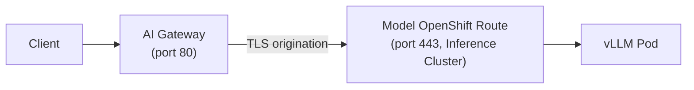

# AI Bridge (MaaS) Demo — Technical Architecture

## Executive Summary

This document describes the AI Bridge demonstration environment built on Red Hat OpenShift AI (RHOAI) 3.4. The environment validates the Models-as-a-Service (MaaS) capabilities across one or two OpenShift clusters, demonstrating centralized model governance, multi-cluster routing, enterprise identity federation, content safety guardrails, and observability.

The demo is structured to align with a PoC validation plan covering Stages A (Foundation), B (Governance & Multi-Tenancy), and C (Enterprise Integration).

---

## Architecture Overview

```mermaid
flowchart TB
    subgraph GWCluster["Gateway Cluster — optional, for multi-cluster"]
        direction TB
        NS1["Namespace: ai-gateway"]
        AIGw["AI Inference Gateway<br/>(Istio + Gateway API)"]
        SE["ServiceEntry<br/>(remote model route)"]
        DR["DestinationRule<br/>(TLS origination)"]
        HR["HTTPRoute<br/>(Host rewrite)"]
        VaultNS["Namespace: vault-dev"]
        VaultPod["Vault (dev mode)"]
        ESO["External Secrets Operator"]

        NS1 --> AIGw
        AIGw --> SE
        AIGw --> DR
        AIGw --> HR
        VaultNS --> VaultPod
        ESO -->|"sync to K8s Secrets"| VaultPod
    end

    subgraph InfCluster["Inference Cluster"]
        direction TB
        NS2["Namespace: llm-inference"]
        MaaS["MaaS Gateway<br/>(Envoy + Authorino + Limitador)<br/>— created by RHOAI operator"]
        AuthP["AuthPolicy<br/>(API key + OIDC)"]
        RLP["TokenRateLimitPolicy<br/>(per subscription)"]
        NS3["Namespace: ai-guardrails"]
        Guard["Guardrails Gateway<br/>(PII regex detection)"]
        EPP["llm-d EPP<br/>(InferencePool + InferenceModel)"]
        Model["vLLM Pod<br/>(Qwen2.5-7B-Instruct)"]
        PG["PostgreSQL<br/>(maas-db namespace)"]
        Mon["User Workload Monitoring<br/>(Prometheus)"]

        NS2 --> MaaS
        MaaS --> AuthP
        MaaS --> RLP
        NS3 --> Guard
        EPP -.-> Model
        MaaS -.-> PG
        MaaS -.-> Mon
    end

    ExtIdP(["External OIDC Provider<br/>(Keycloak / Okta / Azure AD)"])

    Client(["API Consumer"]) -->|"Direct access<br/>(auth + rate limit)"| MaaS
    Client -->|"Multi-cluster path"| AIGw
    AIGw -->|"TLS origination<br/>to model OpenShift Route"| Model
    MaaS -->|"authenticated traffic"| Model
    Guard -->|"PII filter proxy"| Model
    ExtIdP -.->|"JWT issuer endpoint"| AuthP
```



**Important:** The multi-cluster AI Gateway enforces OIDC/JWT authentication via Authorino (validating tokens against the local Keycloak instance) before forwarding to the model's OpenShift Route on the inference cluster. Unauthenticated requests receive 401. The direct MaaS path uses API keys; the multi-cluster path uses OIDC tokens — both paths are auth-protected.

---

## Platform Versions

| Component | Version | Cluster |
|-----------|---------|---------|
| OpenShift Container Platform | 4.19+ | Both |
| Red Hat OpenShift AI (RHOAI) | 3.4.x | Both |
| Red Hat Connectivity Link (RHCL/Kuadrant) | 1.3.x | Both |
| Authorino | Managed by RHCL | Both |
| Limitador | Managed by RHCL | Both |
| NVIDIA GPU Operator | 25.x | Both |
| Service Mesh (Istio) | 3.x | Gateway (multi-cluster only) |
| HashiCorp Vault | 1.17 (dev mode) | Gateway |
| External Secrets Operator | Red Hat ESO | Gateway |

---

## Demonstrated Capabilities

### Stage A: AI Bridge Foundation

#### A1. MaaS Enablement

**What it is:** Models-as-a-Service provides a centralized governance layer for LLM access. It deploys an API gateway (Envoy + Authorino + Limitador) in front of model endpoints, handling authentication, authorization, rate limiting, and usage tracking.

**What's deployed:**
- `DataScienceCluster` with `modelsAsService: Managed`
- PostgreSQL backend (`maas-db` namespace) storing MaaS internal state (subscriptions, key hashes, usage)
- `maas-default-gateway` Gateway resource created by the RHOAI operator
- Authorino handling ext-auth decisions via gRPC

**Demo flow:**
1. Admin creates a `MaaSSubscription` for a team
2. Engineer generates an API key scoped to that subscription
3. Requests to the MaaS endpoint are authenticated, rate-limited, and metered
4. Usage data is recorded per-subscription and exposed via Prometheus

#### A2. Model Serving (Qwen2.5-7B-Instruct)

**What it is:** A production-grade LLM served via vLLM with GPU acceleration, exposed through the AI Bridge as an OpenAI-compatible endpoint.

**What's deployed:**
- `LLMInferenceService` CR managing the vLLM pod
- PVC with model weights downloaded from HuggingFace
- KServe runtime serving on port 8000 (HTTPS)
- OpenAI-compatible API (`/v1/chat/completions`, `/v1/models`)

**Validation:**
```bash
curl -H "Authorization: Bearer <api-key>" \
  https://<MAAS_GW_HOST>/llm-inference/qwen25-7b-instruct/v1/chat/completions \
  -d '{"model":"qwen25-7b-instruct","messages":[{"role":"user","content":"Hello"}]}'
```

#### A3. llm-d Intelligent Routing

**What it is:** The llm-d Endpoint Picker Pod provides inference-aware request routing using the Gateway API `InferencePool` and `InferenceModel` CRDs from `inference.networking.x-k8s.io`. It routes requests to the optimal vLLM replica based on load, KV cache utilization, and model availability.

**What's deployed:**
- `InferencePool` (API: `inference.networking.k8s.io/v1` — GA)
- `InferenceModel` (API: `inference.networking.x-k8s.io/v1alpha2`)
- EPP Deployment with proper RBAC for both API groups

#### A4. Multi-Cluster Routing

**What it is:** A centralized AI Gateway on one cluster routes inference requests to model endpoints on a remote cluster via Istio, providing a single entry point for consumers regardless of where models are physically deployed.

**Important caveat:** This routing path goes directly to the model's OpenShift Route on the inference cluster. It does **not** pass through the MaaS governance layer (auth/rate-limiting). It demonstrates network connectivity and Istio routing patterns.

**What's deployed (gateway cluster):**
- Istio `Gateway` (listening on port 80 HTTP)
- `HTTPRoute` with Host header rewrite for the remote cluster's route
- `ServiceEntry` declaring the remote model route as an external mesh service
- `DestinationRule` configuring TLS origination (SIMPLE mode)

**Traffic flow:**



---

### Stage B: Governance & Multi-Tenancy

#### B1. Per-Use-Case Authentication (API Keys + Subscriptions)

Each team/use-case gets its own subscription with independently managed API keys. Keys are scoped to specific models and can be created, rotated, and revoked.

**What's deployed:**
- `MaaSSubscription` CRs for three teams (premium, standard, basic tiers)
- API keys managed via MaaS CLI/API, hashes stored in PostgreSQL, validated by Authorino on each request

#### B2. Token-Based Rate Limiting

Rate limits enforced per-subscription using **tokens per hour**. Token-based limiting accounts for prompt size, preventing large-prompt requests from consuming disproportionate capacity.

**What's deployed:**
- `tokenRateLimits` configured per subscription tier in `MaaSSubscription` CRs
- Limitador enforcing counters per subscription ID
- Prometheus metrics for rate limit events

**Tier configuration:**
- Premium: 500,000 tokens/hr
- Standard: 100,000 tokens/hr
- Basic: 50,000 tokens/hr

#### B3. Tiered Access

Multiple subscription tiers with independent rate limit policies. Each tier gets its own throughput allocation.

#### B4. Usage Tracking

Per-subscription request count and token usage visible via Prometheus metrics.

**What's deployed:**
- `ServiceMonitor` for Authorino metrics
- `ServiceMonitor` for Limitador metrics
- Grafana dashboard ConfigMap with panels for requests, tokens, rate limits, latency

---

### Stage C: Enterprise Integration

#### C1. OIDC / SSO Integration

The AI Bridge can federate with an enterprise identity provider (Keycloak, Okta, Azure AD, or any OIDC-compliant IdP) to support token-based authentication alongside API keys.

**What's deployed (in this repo):**
- Authorino `AuthConfig` validating JWTs from the configured OIDC issuer (`manifests/oidc/authconfig.yaml`)
- Dual authentication: both API keys and OIDC Bearer tokens accepted

**External prerequisite (NOT deployed by this repo):**
- An OIDC-compliant identity provider with:
  - A realm/tenant (e.g., `ai-bridge`)
  - An OIDC client with `client_credentials` and/or `authorization_code` grant enabled
  - Roles: `ai-admin`, `ai-engineer` assigned to users/clients
- Set `KEYCLOAK_HOST` in `scripts/config.env` to your IdP's issuer hostname
- The `AuthConfig` manifest requires the `REPLACE_WITH_KEYCLOAK_ISSUER_URL` placeholder to be filled

#### C2. Secret Management (External Secrets Operator + Vault)

Demonstrates the **pattern** of zero-downtime credential rotation by syncing secrets from HashiCorp Vault to Kubernetes Secrets via the External Secrets Operator.

**What's deployed:**
- HashiCorp Vault (dev mode, in-memory) with KV v2 secrets engine
- Vault secrets: `ai-bridge/api-keys`, `ai-bridge/db-credentials`
- Red Hat External Secrets Operator
- `SecretStore` pointing to Vault with token auth
- `ExternalSecret` resources syncing Vault → K8s Secrets (30-second refresh)

**Current limitation:** The K8s Secrets created by ESO are not currently consumed by the MaaS gateway or PostgreSQL. This demonstrates the rotation infrastructure pattern but is not wired end-to-end. Production use would mount these secrets into the relevant workloads.

#### C3. Observability

Dashboards showing inference metrics per subscription with rate limit event visibility.

**Key metrics:**
- `authorino_auth_server_evaluator_total` — auth decisions per subscription
- `limitador_counter_value` — current rate limit counter values
- `limitador_requests_total` — total requests processed
- Standard vLLM metrics: TTFT, throughput, queue depth

#### C4. Guardrails Gateway (Content Safety)

An inline content safety filter that inspects requests and responses for PII using **regex-based pattern matching**.

**What's deployed:**
- Guardrails Gateway container (port 8090)
- Orchestrator proxy sidecar (Python, port 8085) connecting to the vLLM backend
- **Regex-based** detectors for: email addresses, SSN patterns, credit card numbers
- Two endpoints:
  - `/passthrough/v1/chat/completions` — no detection, direct proxy
  - `/pii/v1/chat/completions` — PII regex detection on input and output

**What is NOT implemented:**
- LLM-based prompt injection detection
- Semantic content analysis
- TrustyAI integration (requires separate orchestrator)

---

## Key Technical Decisions

| Decision | Rationale |
|----------|-----------|
| PVC-based model download (not image pull) | HuggingFace download is more portable across environments |
| Self-signed TLS for MaaS gateway | Production should use cert-manager with proper CA |
| Vault dev mode (in-memory) | Demo simplicity; production uses HA Vault with persistent storage |
| Python orchestrator proxy for guardrails | Lightweight proxy demonstrates the architecture pattern without requiring full TrustyAI stack |
| Host header rewrite in HTTPRoute | Required for Istio TLS origination to match remote route hostname |
| Multi-cluster uses OIDC (not API keys) | Gateway cluster validates JWTs locally via Keycloak; production may unify to single auth mechanism |
| ESO secrets not consumed by MaaS | Demonstrates rotation infrastructure; wiring to workloads is environment-specific |
| Scripts use imperative `oc apply` ordering | Ensures correct deployment sequence; Kustomize profiles available for declarative use |

---

## Endpoints Reference

| Endpoint | URL Pattern | Auth | Notes |
|----------|-------------|------|-------|
| MaaS Gateway (inference) | `https://<MAAS_GW_HOST>/llm-inference/<model>/v1/chat/completions` | API key or OIDC token | Created by RHOAI operator |
| Multi-cluster Gateway | `http://<AI_GW_HOST>:80/v1/chat/completions` | OIDC JWT | Keycloak token required; Authorino validates locally |
| Guardrails (passthrough) | `http://<GUARDRAILS_HOST>/passthrough/v1/chat/completions` | None | No filtering |
| Guardrails (PII filter) | `http://<GUARDRAILS_HOST>/pii/v1/chat/completions` | None | Regex PII detection |
| OIDC Provider | `https://<KEYCLOAK_HOST>/realms/<realm>` | admin creds | External — not deployed here |
| Vault API | `http://vault.vault-dev.svc:8200` (cluster-internal) | Token from `vault-token` Secret | Dev mode only |

---

## Prerequisites for Replication

To replicate this in any environment:

1. **RHOAI 3.4** operator installed on both clusters
2. **RHCL operator** installed (Kuadrant/Authorino/Limitador) on both clusters
3. **NVIDIA GPU Operator** on both clusters
4. **Istio/Service Mesh** on gateway cluster (multi-cluster only)
5. **Network connectivity** between clusters for multi-cluster routing
6. **(Optional)** Enterprise OIDC provider (Keycloak, Okta, Azure AD) for SSO demo
7. **(Optional)** HashiCorp Vault for secret rotation pattern demo
