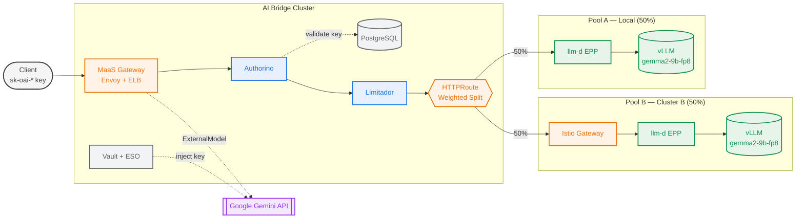
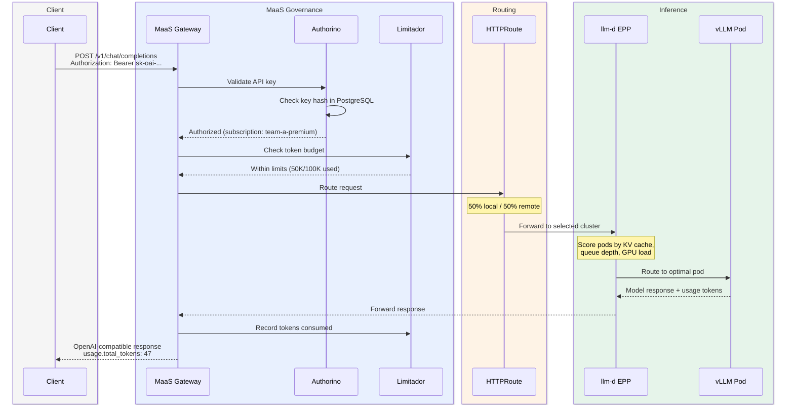
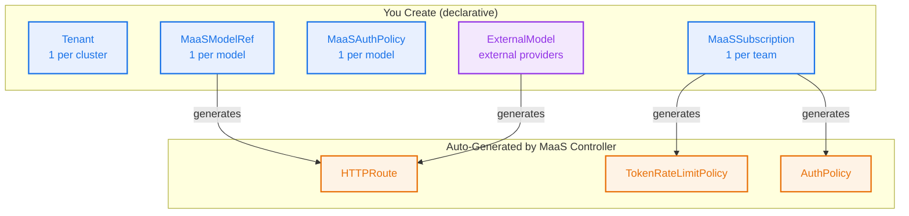

# AI Bridge Demo — MaaS Governance + Multi-Cluster Distributed Inference

> **Product**: Models-as-a-Service (MaaS) + Distributed Inference with llm-d — Red Hat OpenShift AI 3.4  
> **Pattern**: AI Bridge — centralized governance for distributed AI infrastructure  
> **Format**: Tell-Show-Tell with persona-based acts  
> **Duration**: 60 minutes (see timing options below)

---

## Executive Summary

### The Problem

When enterprises let hundreds of teams use AI models, they face chaos:

| Challenge | Impact |
|-----------|--------|
| **Access control** | Who gets access to which models? |
| **Resource management** | One team hogs all capacity |
| **Accountability** | No tracking of who used what |
| **Security** | Shared credentials, no audit trail |
| **Scale** | Same model needed in multiple locations |

### The Solution

MaaS provides a **single front door** for AI model access with built-in governance:

| Capability | What It Means |
|------------|---------------|
| **One entry point** | Users don't know where models run. Hit one URL, system routes appropriately. |
| **Per-team controls** | Team A: 100K tokens/min. Team B: 20K tokens/min. Independent quotas. |
| **Multi-cluster LB** | Same model on multiple clusters, load balanced through a single endpoint. |
| **Guardrails** | Exceed limit → 429. Bad key → 401. PII detected → blocked. Other teams unaffected. |
| **Enterprise-ready** | Secrets via Vault. GitOps-managed. Full audit trail. llm-d for intelligent routing. |

---

## Quick Reference

### Demo Timing Options

| Slot | Acts | Focus |
|------|------|-------|
| **60 min** | All acts (1-12) | Full demo with all personas |
| **45 min** | Acts 1-3, 5-7, 9, 12 | Core governance + multi-cluster + external provider |
| **30 min** | Acts 1, 5, 7, 9, 12 | Governance + LB + external + summary |
| **15 min** | Acts 1, 5, 9 | Quick overview for executives |

### Available Models

| Model | Type | Status | Backend |
|-------|------|--------|---------|
| `gemma2-9b-fp8` | Local + Multi-cluster | Ready | vLLM on AI Bridge + Cluster B |
| `gemini-2-0-flash` | External | Ready | Google Gemini API |

### URLs

| Component | URL |
|-----------|-----|
| RHOAI Dashboard | `https://rhods-dashboard-redhat-ods-applications.apps.cluster-6crhb.6crhb.sandbox1011.opentlc.com` |
| MaaS Gateway | `https://<MAAS_GW>` (AWS ELB) |
| OpenShift Console | `https://console-openshift-console.apps.cluster-6crhb.6crhb.sandbox1011.opentlc.com` |

---

## Pre-Demo Setup

```bash
oc login https://api.cluster-6crhb.6crhb.sandbox1011.opentlc.com:6443 --username=admin --password=<PASSWORD> --insecure-skip-tls-verify

export MAAS_GW="ae7a90237753943bb8619a15f4c4ff3e-47983113.us-east-2.elb.amazonaws.com"
export API_KEY="<YOUR_API_KEY>"  # Generate via RHOAI Dashboard
```

### Pre-Flight Checklist (run 5 min before the call)

```bash
# 1. Model Ready on all clusters
echo "Bridge: $(oc --context=inference-b get llminferenceservice gemma2-9b-fp8 -n models-as-a-service -o jsonpath='{.status.conditions[?(@.type=="Ready")].status}')"
echo "Cluster A: $(oc --context=inference-a get llminferenceservice gemma2-9b-fp8 -n llm-inference -o jsonpath='{.status.conditions[?(@.type=="Ready")].status}')"
echo "Cluster B: $(oc --context=ai-bridge get llminferenceservice gemma2-9b-fp8 -n models-as-a-service -o jsonpath='{.status.conditions[?(@.type=="Ready")].status}')"
# Expected: True / True / True

# 2. KServe llm-d EPP Running
echo "Bridge EPP: $(oc --context=inference-b get pods -n models-as-a-service --no-headers | grep router-scheduler | awk '{print $2,$3}')"
# Expected: 3/3 Running

# 3. Standard endpoint
curl -sk --max-time 10 -o /dev/null -w "Standard: HTTP %{http_code}\n" \
  "https://${MAAS_GW}/models-as-a-service/gemma2-9b-fp8/v1/chat/completions" \
  -H "Authorization: Bearer ${API_KEY}" -H "Content-Type: application/json" \
  -d '{"model":"gemma2-9b-fp8","messages":[{"role":"user","content":"hi"}],"max_tokens":3}'
# Expected: HTTP 200

# 4. Multi-cluster LB
curl -sk --max-time 20 -o /dev/null -w "Multi-cluster: HTTP %{http_code}\n" \
  "https://${MAAS_GW}/multi-cluster/gemma2-9b-fp8/v1/chat/completions" \
  -H "Authorization: Bearer ${API_KEY}" -H "Content-Type: application/json" \
  -d '{"model":"gemma2-9b-fp8","messages":[{"role":"user","content":"hi"}],"max_tokens":3}'
# Expected: HTTP 200

# 5. Gemini external provider
curl -sk --max-time 10 -o /dev/null -w "Gemini: HTTP %{http_code}\n" \
  "https://${MAAS_GW}/models-as-a-service/gemini-2-0-flash/v1/chat/completions" \
  -H "Authorization: Bearer ${API_KEY}" -H "Content-Type: application/json" \
  -d '{"model":"gemini-2.0-flash","messages":[{"role":"user","content":"hi"}],"max_tokens":3}'
# Expected: HTTP 200
```

> All 5 checks must pass before starting the demo. If Gemini returns 400, update `vault-seed-credentials` on the cluster (never in Git).

**Architecture Visualizations** (open these before the call):
- [AI Grid — Single Gateway](https://noyitz.github.io/ai-gateway-docs/single-gateway/) — primary demo architecture
- [AI Grid — Multi-Cluster Mesh](https://noyitz.github.io/ai-gateway-docs/multi-cluster/) — alternative topology
- [AI Inference Gateway Flow](https://noyitz.github.io/ai-gateway-docs/ai-gateway-flow.html) — detailed request processing

---

## Architecture



> The same model is also deployed on **Inference Cluster A (4l6x6)** with KServe-managed llm-d, demonstrating multi-location deployment. Cluster A is accessible through its own gateway and can be added to the weighted route at any time.

### Request Lifecycle



### Two Levels of Routing

| Level | Component | What it does | When it matters |
|-------|-----------|-------------|-----------------|
| **Cross-cluster** | Gateway API weighted HTTPRoute | Splits traffic 50/50 between AI Bridge (local) and Cluster B (remote) | Always — distributes load across clusters |
| **Intra-cluster** | llm-d EPP (KServe-managed) | Scores vLLM pods by KV cache utilization, queue depth, and load; picks the optimal replica | When `replicas > 1` — intelligent pod selection within each cluster |

---

## Act 1: Architecture Overview (5 min)

> **Persona**: Solution Architect  
> **Goal**: Set context — show the multi-cluster topology and AI Grid vision

> **Scenario**: The customer has asked to deploy the same model across multiple RHOAI environments for resilience and scale. They want to understand the overall architecture before seeing it in action.
>
> **What we'll show**: The AI Grid visualization, then live proof that gemma2-9b-fp8 is deployed and Ready on 3 separate OpenShift clusters, each with KServe-managed llm-d.
>
> **Requirement addressed**: *Deploy model in 2 or more locations/RHOAI environment*

### TELL

"We're demonstrating the AI Bridge pattern — centralized governance for distributed AI infrastructure. The same model, gemma2-9b-fp8, is deployed across multiple RHOAI environments. Each environment runs llm-d for intelligent inference routing. The AI Bridge provides a single endpoint with authentication, rate limiting, and load balancing across all environments."

### SHOW

**Open the AI Grid visualization:**

Show [AI Grid — Single Gateway](https://noyitz.github.io/ai-gateway-docs/single-gateway/) and walk through the flow:
- 1 Gateway with MaaS governance (auth, rate limiting, IPP)
- 2 InferencePools (Pool A = local, Pool B = remote cluster)
- External providers as fallback

"This is the architecture running live right now across 3 OpenShift clusters."

```bash
# Model deployed on all 3 clusters
oc --context=inference-b get llminferenceservice -n models-as-a-service
oc --context=inference-a get llminferenceservice -n llm-inference
oc --context=ai-bridge get llminferenceservice -n models-as-a-service
```
→ gemma2-9b-fp8 Ready on all 3

```bash
# llm-d managed by KServe on all 3
oc --context=inference-b get pods -n models-as-a-service | grep router-scheduler
oc --context=inference-a get pods -n llm-inference | grep router-scheduler
oc --context=ai-bridge get pods -n models-as-a-service | grep router-scheduler
```
→ 3/3 Running on every cluster

### TELL

"The model is deployed in 3 locations. llm-d is KServe-managed on every cluster — you add `scheduler: {}` to the LLMInferenceService and KServe handles the rest: EPP pod, InferencePool, gateway wiring. No standalone deployments, no manual RBAC. One line of YAML."

---

## Act 2: Platform Foundation + GitOps (5 min)

> **Persona**: Cluster Administrator  
> **Goal**: Show MaaS is enabled, governance stack is running, everything is GitOps-managed

> **Scenario**: The platform team needs to know that the AI governance layer is production-grade: operator-managed, declarative, version-controlled, and auto-synced from Git.
>
> **What we'll show**: `modelsAsService: Managed`, Tenant Active, ArgoCD Synced/Healthy.
>
> **Requirement addressed**: *Admin Persona: Deploy model via UI / RHOAI environment*

### TELL

"MaaS is a governance layer in RHOAI 3.4. One configuration change enables it. The entire stack is declarative — defined in Git, deployed via operators."

### SHOW

**UI — OpenShift Console:**
- Operators → Installed Operators → Red Hat OpenShift AI
- Show DataScienceCluster with `modelsAsService: Managed`

```bash
oc get datasciencecluster default-dsc \
  -o jsonpath='{.spec.components.kserve.modelsAsService.managementState}'
```
→ `Managed`

```bash
oc get tenant default-tenant -n models-as-a-service
```
→ `Active`

```bash
# Inference clusters do NOT have MaaS — only the AI Bridge does
oc --context=inference-a get datasciencecluster default-dsc \
  -o jsonpath='{.spec.components.kserve.modelsAsService.managementState}'
```
→ `Removed`

```bash
# GitOps — Synced and Healthy
oc get applications.argoproj.io maas-demo-gateway -n openshift-gitops \
  -o jsonpath='Sync: {.status.sync.status}  Health: {.status.health.status}'
```
→ `Sync: Synced  Health: Healthy`

**Key point:** "Change a subscription limit in Git → push → ArgoCD syncs automatically → MaaS enforces the new limit. No manual `oc apply`, no drift."

### TELL

"With MaaS enabled, the platform automatically provisions Authorino for API key validation, Limitador for token-based rate limiting, MaaS API for key management, and PostgreSQL for storing key hashes. Cluster admins enable it once. The operator handles the rest."

---

## Act 3: Governance Configuration (5 min)

> **Persona**: AI Administrator  
> **Goal**: Define who can access which models with what limits

> **Scenario**: AI administrators need to set up per-team governance declaratively. Each team gets a subscription with model access and token limits. The MaaS controller auto-generates rate-limit policies from subscriptions.
>
> **What we'll show**: Subscription YAML, tiered access model, auto-generated policies.
>
> **Requirement addressed**: *Admin/User Persona: Ability to track the usage of Tokens*

### TELL

"Subscriptions are the core governance primitive. Each team gets independent quotas, model access control, and priority levels. Everything is a Kubernetes resource — version-controlled, auditable, GitOps-friendly."

### SHOW

**UI — RHOAI Dashboard:**
- Settings → Subscriptions → show list of subscriptions
- Click a subscription to show details (groups, models, limits)


```bash
oc get maassubscriptions -n models-as-a-service \
  -o custom-columns="NAME:.metadata.name,PHASE:.status.phase,PRIORITY:.spec.priority"
```
→ Shows 7 subscriptions: admin, team-a-premium, team-a-ml-engineering, team-b-standard, team-b-data-science, team-c-basic, team-c-app-developers

**Example Subscription YAML:**
```yaml
apiVersion: maas.opendatahub.io/v1alpha1
kind: MaaSSubscription
metadata:
  name: team-a-premium
  namespace: models-as-a-service
spec:
  owner:
    groups:
      - name: "team-a"
      - name: "system:authenticated"
  modelRefs:
    - name: gemma2-9b-fp8
      namespace: models-as-a-service
      tokenRateLimits:
        - limit: 100000
          window: "1m"
    - name: gemini-2-0-flash
      namespace: models-as-a-service
      tokenRateLimits:
        - limit: 50000
          window: "1m"
  priority: 10
```

**Tiered Access Model:**

| Tier | Subscription | Token Limit | Use Case |
|------|-------------|-------------|----------|
| Premium | `team-a-premium` | 100K tokens/min | Production workloads |
| Standard | `team-b-standard` | 20K tokens/min | Development |
| Basic | `team-c-basic` | 5K tokens/min | Experimentation |

### TELL

"The MaaS controller automatically generates `TokenRateLimitPolicy` resources from subscriptions. You never create rate-limit policies manually. One team's burst cannot affect another — quotas are independent."

---

## Act 4: Authentication Enforcement (5 min)

> **Persona**: Security / Platform Team  
> **Goal**: Prove zero-trust authentication at the gateway

> **Scenario**: Every request to the AI Bridge must be authenticated. The security team needs to see that unauthenticated requests are rejected, invalid keys are blocked, and valid keys grant access. The same key works for local models AND external providers.
>
> **What we'll show**: 401 → 403 → 200 progression, then same key routing to Gemini.
>
> **Requirement addressed**: *Show AI gateway handling routing and prompt processing*

### TELL

"Every request is validated. No auth = rejection. Wrong key = rejection. The API is OpenAI-compatible — existing code works with just a base_url change."

### SHOW

```bash
# 1. No auth → 401
curl -sk -w "\nHTTP %{http_code}\n" -o /dev/null \
  "https://${MAAS_GW}/models-as-a-service/gemma2-9b-fp8/v1/chat/completions" \
  -H "Content-Type: application/json" \
  -d '{"model":"gemma2-9b-fp8","messages":[{"role":"user","content":"hi"}]}'
```
→ `HTTP 401`

```bash
# 2. Fake key → 403
curl -sk -w "\nHTTP %{http_code}\n" -o /dev/null \
  "https://${MAAS_GW}/models-as-a-service/gemma2-9b-fp8/v1/chat/completions" \
  -H "Authorization: Bearer sk-oai-FAKE-KEY" \
  -H "Content-Type: application/json" \
  -d '{"model":"gemma2-9b-fp8","messages":[{"role":"user","content":"hi"}]}'
```
→ `HTTP 403`

```bash
# 3. Valid key → 200
curl -sk "https://${MAAS_GW}/models-as-a-service/gemma2-9b-fp8/v1/chat/completions" \
  -H "Authorization: Bearer ${API_KEY}" \
  -H "Content-Type: application/json" \
  -d '{"model":"gemma2-9b-fp8","messages":[{"role":"user","content":"What is OpenShift AI?"}],"max_tokens":50}' \
  | python3 -m json.tool
```
→ HTTP 200, model responds

### TELL

"Zero trust by default. 401 = no credentials. 403 = Authorino checked the key against PostgreSQL and rejected it. 200 = valid key, subscription verified, token budget checked — all before the request reaches the model. The `sk-oai-*` format is intentionally OpenAI-compatible."

---

## Act 5: User Self-Service (7 min)

> **Persona**: Developer / Data Scientist  
> **Goal**: Show the complete user journey from finding models to making API calls

> **Scenario**: Users need to self-serve without admin help. They browse models, see their subscription limits, generate API keys, and test in the Playground — no command line required.
>
> **What we'll show**: Dashboard UI journey through model discovery, API key generation, Playground testing, and Python SDK integration.
>
> **Requirement addressed**: *Deploy model via UI (bonus points)*

### TELL

"Users self-serve through the RHOAI Dashboard. They browse available models, see their subscription limits, generate API keys, and test in the playground — no kubectl or cluster access required."

### SHOW

**UI — RHOAI Dashboard:**

1. **Gen AI Studio → AI asset endpoints** — show models list


2. Click **View** on gemma2-9b-fp8 — show endpoint URL + subscription selector
3. Click **Generate API key** — show `sk-oai-*` key (explain: shown only once)


4. **Gen AI Studio → Playground** — type a prompt, show model responding


5. **Gen AI Studio → API keys** — show key management (create, view, revoke)


**Python SDK:**
```python
from openai import OpenAI

client = OpenAI(
    base_url="https://<MAAS_GW>/models-as-a-service/gemma2-9b-fp8/v1",
    api_key="sk-oai-..."
)

response = client.chat.completions.create(
    model="gemma2-9b-fp8",
    messages=[{"role": "user", "content": "Hello!"}]
)
print(response.choices[0].message.content)
```

### TELL

"Complete self-service. Users don't need admin help. Keys are scoped to their subscription's models and token limits. Revocation is permanent and immediate. Standard OpenAI SDKs work with just a base_url change."

---

## Act 6: Single Endpoint + Token Tracking (5 min)

> **Persona**: Admin/User — single endpoint, token accountability  
> **Goal**: Show one URL for all model access, with per-subscription token tracking

> **Scenario**: Multiple teams consume the same model. The platform team needs per-team usage data for cost allocation and chargeback.
>
> **What we'll show**: Live request with `usage.total_tokens` in response, 7 active subscriptions.
>
> **Requirements addressed**: *Single Endpoint behind AI Gateway* + *Token usage tracking*

### TELL

"The AI Bridge exposes every model as a single OpenAI-compatible endpoint. Token usage is tracked per subscription for cost allocation."

### SHOW

```bash
curl -sk "https://${MAAS_GW}/models-as-a-service/gemma2-9b-fp8/v1/chat/completions" \
  -H "Authorization: Bearer ${API_KEY}" \
  -H "Content-Type: application/json" \
  -d '{"model":"gemma2-9b-fp8","messages":[{"role":"user","content":"What is Red Hat OpenShift AI?"}],"max_tokens":50}' \
  | python3 -m json.tool
```
→ HTTP 200, note `usage.total_tokens` in the response

"Limitador accumulates total_tokens per subscription per time window. When the budget is exhausted, HTTP 429."

### TELL

"One URL, one API key format, standard OpenAI SDKs. Token tracking enables per-team cost allocation without any application changes."

---

## Act 7: Rate Limiting + Noisy Neighbor Protection (5 min)

> **Persona**: Platform Team / AI Administrator  
> **Goal**: Prove noisy-neighbor protection with independent token budgets

> **Scenario**: A basic-tier team sends a burst of large requests. Their token limit should be hit (429) while premium-tier teams continue unaffected. This proves independent quotas.
>
> **What we'll show**: Burst test hitting 429, then premium key still returning 200.
>
> **Requirement addressed**: *Ability to track the usage of Tokens* + *Show AI gateway handling routing*

### TELL

"Each subscription has independent token budgets. A burst from one team cannot impact another. Token-based limiting accounts for prompt size — a 1000-token prompt consumes 100x more than a 10-token prompt."

### SHOW

```bash
# Burst test — multiple requests consume tokens quickly
for i in 1 2 3 4 5; do
  curl -sk -w "Request $i: HTTP %{http_code}\n" -o /dev/null \
    "https://${MAAS_GW}/models-as-a-service/gemma2-9b-fp8/v1/chat/completions" \
    -H "Authorization: Bearer ${API_KEY}" -H "Content-Type: application/json" \
    -d '{"model":"gemma2-9b-fp8","max_tokens":500,"messages":[{"role":"user","content":"Write a detailed essay about cloud computing."}]}'
done
```
→ First requests: HTTP 200, later requests: HTTP 429 (rate limited)

```bash
# Check response headers for rate limit info
curl -sk -D- -o /dev/null "https://${MAAS_GW}/models-as-a-service/gemma2-9b-fp8/v1/chat/completions" \
  -H "Authorization: Bearer ${API_KEY}" -H "Content-Type: application/json" \
  -d '{"model":"gemma2-9b-fp8","messages":[{"role":"user","content":"hello"}],"max_tokens":10}' 2>&1 | head -15
```

### TELL

"When a limit is hit, the AI Bridge returns HTTP 429 with retry headers. Other subscriptions are completely unaffected — Limitador tracks counters per subscription, not globally. This is noisy-neighbor protection."

---

## Act 8: Multi-Cluster Load Balancing (7 min)

> **Persona**: Admin — deploy model in 2+ locations, load balance  
> **Goal**: Prove the same model on 2 clusters with traffic distributed through the AI Bridge

> **Scenario**: The same model is deployed on the AI Bridge and on a remote inference cluster. The customer wants a single endpoint that load-balances across both.
>
> **What we'll show**: Weighted HTTPRoute, 6 requests all HTTP 200, proxy logs proving both backends, annotated EPP logs.
>
> **Requirements addressed**: *Load balance between 2 clusters* + *AI gateway routing*

### TELL

"Routing happens at two levels. The Gateway API weighted HTTPRoute distributes traffic 50/50 across clusters. llm-d EPP on each cluster selects the optimal replica within that cluster. With one replica today, llm-d passes through. When we scale to multiple replicas, intelligent routing kicks in automatically."

### SHOW

```bash
# 50/50 weighted backends
oc get httproute gemma-multi-cluster-route -n models-as-a-service \
  -o jsonpath='{range .spec.rules[0].backendRefs[*]}name={.name} weight={.weight}{"\n"}{end}'
```
→ local weight=50, remote weight=50

```bash
# 6 requests — all HTTP 200
for i in 1 2 3 4 5 6; do
  curl -sk --max-time 20 -o /dev/null -w "Request $i: HTTP %{http_code}\n" \
    "https://${MAAS_GW}/multi-cluster/gemma2-9b-fp8/v1/chat/completions" \
    -H "Authorization: Bearer ${API_KEY}" -H "Content-Type: application/json" \
    -d "{\"model\":\"gemma2-9b-fp8\",\"messages\":[{\"role\":\"user\",\"content\":\"Hello $i\"}],\"max_tokens\":5}"
done
```

```bash
# Proxy logs — traffic to both backends
GATEWAY_POD=$(oc get pods -n openshift-ingress -l gateway.networking.k8s.io/gateway-name=maas-default-gateway --no-headers | head -1 | awk '{print $1}')
oc logs $GATEWAY_POD -n openshift-ingress --since=30s | grep multi-cluster | \
  awk '{if ($0 ~ /kserve-workload/) print "  → LOCAL (AI Bridge)"; else print "  → REMOTE (Cluster B)"}'
```

**llm-d EPP proof:**

```bash
oc logs -n models-as-a-service deploy/gemma2-9b-fp8-kserve-router-scheduler -c main --tail=5
```

```
{"msg":"EPP received request","x-request-id":"5c8f45b0-..."}       ← Request entered EPP
{"msg":"EPP sent request body response(s) to proxy",                ← EPP scored pods, made decision
  "modelName":"gemma2-9b-fp8","targetModelName":"gemma2-9b-fp8"}    ← Correct model resolved
{"msg":"EPP sent response body back to proxy"}                      ← Response flowed back through EPP
```

> The `x-request-id` matches the client's response `id` — proving the request went through llm-d.

### TELL

"The weighted HTTPRoute handles cross-cluster distribution. llm-d handles intra-cluster optimization. They're complementary. MaaS governance applies identically regardless of which cluster serves the request."

---

## Act 9: External Provider + Enterprise Security (5 min)

> **Persona**: Admin — route to external provider, secure credentials  
> **Goal**: Show Gemini routing, Vault integration, secret rotation

> **Scenario**: Some prompts need capabilities the local model doesn't have. The AI Bridge routes to Google Gemini transparently. Provider credentials come from Vault — never in Git, never exposed to users.
>
> **What we'll show**: ExternalModel CR, live Gemini request, Vault/ESO chain, secret rotation.
>
> **Requirement addressed**: *Route to external provider/NeoCloud*

### TELL

"The AI Bridge routes to any OpenAI-compatible backend. Provider credentials are stored in Vault and injected server-side. Same API key works for everything."

### SHOW

```bash
# ExternalModel
oc get externalmodel -n models-as-a-service
```
→ `gemini-2-0-flash   openai   gemini-2.0-flash   generativelanguage.googleapis.com`

```bash
# Same API key → Gemini
curl -sk "https://${MAAS_GW}/models-as-a-service/gemini-2-0-flash/v1/chat/completions" \
  -H "Authorization: Bearer ${API_KEY}" -H "Content-Type: application/json" \
  -d '{"model":"gemini-2.0-flash","messages":[{"role":"user","content":"What is Red Hat?"}],"max_tokens":50}' \
  | python3 -m json.tool
```
→ HTTP 200 from Gemini

```bash
# Vault + ESO credential chain
oc get externalsecret gemini-credentials -n models-as-a-service \
  -o jsonpath='Status: {.status.conditions[0].reason}'
```
→ `SecretSynced`

"Credential chain: `vault-seed-credentials` → `vault-init` Job → Vault → ESO → K8s Secret → payload-processing injects into outbound requests. No credentials in Git."

### TELL

"Adding a new provider = one ExternalModel CR + one Secret in Vault. Users never change their code. The AI Bridge supports Gemini, OpenAI, Anthropic, Bedrock — any OpenAI-compatible endpoint."

---

## Act 10: Guardrails — Content Safety (5 min)

> **Persona**: Admin / Compliance  
> **Goal**: Show PII detection and content safety enforcement

> **Scenario**: The compliance team requires PII detection before requests reach the model.
>
> **What we'll show**: Clean request passing, PII request detected and refused.
>
> **Requirement addressed**: *Apply guardrails and detect violations*

### TELL

"The AI Bridge includes guardrails for content safety — PII detectors for email, SSN, credit card patterns."

### SHOW

```bash
oc get pods -n ai-guardrails --no-headers
```
→ `guardrails-gateway-*   2/2   Running`

```bash
# Clean request → passes
oc exec -n ai-guardrails deployment/guardrails-gateway -- \
  curl -s http://localhost:8090/passthrough/v1/chat/completions \
  -H "Content-Type: application/json" \
  -d '{"model":"gemma2-9b-fp8","messages":[{"role":"user","content":"What is AI?"}],"max_tokens":30}'
```
→ Normal model response

```bash
# PII request → detected
oc exec -n ai-guardrails deployment/guardrails-gateway -- \
  curl -s http://localhost:8090/pii/v1/chat/completions \
  -H "Content-Type: application/json" \
  -d '{"model":"gemma2-9b-fp8","messages":[{"role":"user","content":"My SSN is 123-45-6789 and card 4111111111111111"}],"max_tokens":20}'
```
→ Model refuses: *"I cannot store or process any personal information..."*

### TELL

"Two endpoints: `/passthrough` for unfiltered, `/pii` for PII detection. In production, this integrates with the IPP pipeline for inline enforcement."

---

## Act 11: GPU & vLLM Metrics (3 min)

> **Persona**: Admin — GPU infrastructure visibility  
> **Goal**: Show metrics from each server

> **Scenario**: Platform team needs GPU utilization and token throughput visibility.
>
> **What we'll show**: Prometheus metrics — token counts, request counts.
>
> **Requirement addressed**: *GPU consumption, vLLM metrics from each Server*

### SHOW

**UI — RHOAI Dashboard → Observe & Monitor → Dashboard**

```bash
curl -sk -H "Authorization: Bearer $(oc whoami -t)" \
  "https://thanos-querier-openshift-monitoring.apps.cluster-6crhb.6crhb.sandbox1011.opentlc.com/api/v1/query?query=kserve_vllm:generation_tokens_total"
```
→ Shows cumulative token count

"195 vLLM metrics available. ServiceMonitors are auto-created by KServe for every deployed model."

---

## Act 12: Summary (3 min)

### Requirements Alignment

| Requirement | Status | Act |
|-------------|--------|-----|
| Deploy model in 2+ locations | Done | Act 1 — 3 RHOAI clusters |
| Deploy via UI (bonus) | Done | Act 5 — RHOAI Dashboard |
| GPU / vLLM metrics | Done | Act 11 — Prometheus, 195 series |
| Single endpoint behind AI Gateway | Done | Act 6 — one URL |
| Token usage tracking | Done | Acts 3, 6 — per-subscription counters |
| AI gateway routing + prompt processing | Done | Acts 4, 8 — auth + llm-d EPP |
| Multi-cluster load balancing | Done | Act 8 — 50/50, 6/6 HTTP 200 |
| Route to external provider | Done | Act 9 — Gemini via ExternalModel |
| Guardrails / PII detection | Done | Act 10 — SSN + credit card detected |
| GitOps managed | Done | Act 2 — ArgoCD Synced/Healthy |

### Key Takeaways

1. **Single front door** — one gateway for all AI model access
2. **Per-team governance** — independent quotas, no noisy neighbors
3. **Multi-cluster LB** — same model on multiple clusters, load balanced
4. **llm-d is KServe-managed** — `scheduler: {}`, no standalone deployments
5. **OpenAI-compatible** — existing code works with base_url change
6. **Self-service** — users browse, generate keys, test without CLI
7. **Multi-provider** — local models + cloud APIs through same gateway
8. **Enterprise security** — Vault secrets, GitOps, audit trail
9. **Full observability** — GPU metrics, token tracking, dashboards
10. **Responsible AI** — guardrails block PII

---

## If They Ask...

| Question | Answer |
|----------|--------|
| Can we add more inference clusters? | "Yes — deploy the model, add `scheduler: {}`, create ServiceEntry/DestinationRule on the AI Bridge, add backend to the weighted HTTPRoute." |
| Does llm-d route across clusters? | "llm-d routes within each cluster. Cross-cluster routing is the AI Bridge's weighted HTTPRoute. They complement each other." |
| Priority-based routing? | "llm-d supports request prioritization (Tech Preview in 3.4)." |
| Autoscaling? | "llm-d autoscaling (Tech Preview) adjusts replicas based on request count, queue depth, and GPU utilization." |
| Our own identity provider? | "Yes — the Tenant CR supports external OIDC. Point `issuerUrl` to your Okta/Azure AD." |
| PostgreSQL? | "MaaS doesn't manage PostgreSQL by design — use your existing DB infrastructure." |

---

## Appendix A: CRD Relationships



## Appendix B: Troubleshooting

| Issue | Check |
|-------|-------|
| **401** | No auth header. Add `Authorization: Bearer sk-oai-...` |
| **403** | Key invalid or unauthorized for this model. Check `oc get maassubscription -o jsonpath='{.spec.modelRefs[*].name}'` |
| **429** | Token limit hit. Wait for window reset (typically 1 minute). Check `oc get maassubscription -o jsonpath='{.spec.modelRefs[*].tokenRateLimits}'` |
| **Model not responding** | Check `oc get maasmodelrefs` (should be Ready) and `oc get pods -l app.kubernetes.io/part-of=llminferenceservice` |
| **ExternalModel not working** | Check credentials Secret has label `inference.networking.k8s.io/bbr-managed: "true"` |

## Appendix C: Glossary

| Term | Definition |
|------|------------|
| **MaaS** | Models-as-a-Service — RHOAI 3.4 governance layer |
| **Tenant** | Singleton CRD anchoring MaaS configuration |
| **MaaSSubscription** | Per-team quota definition |
| **ExternalModel** | Routes to external cloud providers |
| **Kuadrant** | Red Hat Connectivity Link (auth + rate limiting) |
| **Authorino** | API key/JWT validation |
| **Limitador** | Token counting and rate limiting |
| **llm-d** | Distributed inference framework with intelligent pod routing |
| **EPP** | Endpoint Picker Pod — llm-d's scheduler component |
| **ESO** | External Secrets Operator (Vault sync) |

## Appendix D: Environment Details

| Resource | Value |
|----------|-------|
| AI Bridge Cluster | 6crhb / sandbox1011 |
| Inference Cluster A | 4l6x6 / sandbox1213 |
| Inference Cluster B | bf44z / sandbox2582 |
| MaaS Gateway | AWS ELB on AI Bridge |
| Model | gemma2-9b-fp8 (OCI modelcar) |
| llm-d | KServe-managed via `scheduler: {}` |
| Subscriptions | 7 (admin + 3 teams x 2 tiers) |
| External Provider | Google Gemini (via ExternalModel + Vault) |
| GitOps | ArgoCD on all clusters, repo: github.com/rrbanda/maas-demo |

> **Note**: Never commit credentials to Git. The Gemini API key is managed via `vault-seed-credentials` (cluster secret) → `vault-init` PostSync hook → Vault → ESO → K8s Secret.
