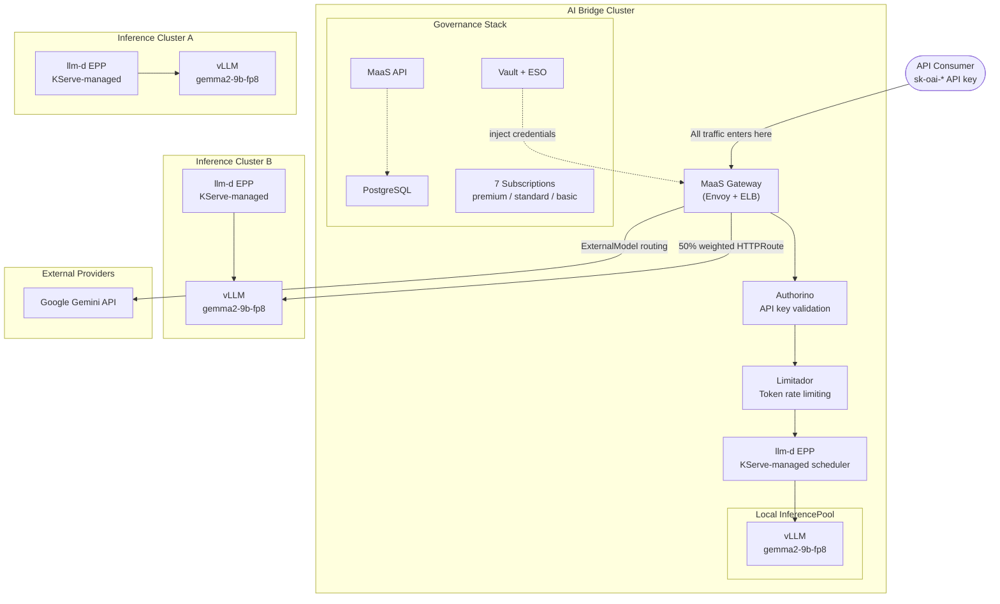
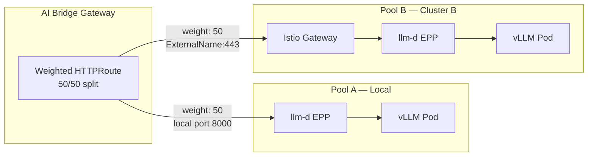

# AI Bridge Demo — Multi-Cluster Distributed Inference

> **Product**: Models-as-a-Service (MaaS) + Distributed Inference with llm-d — Red Hat OpenShift AI 3.4  
> **Pattern**: AI Bridge — centralized governance with distributed inference across multiple RHOAI environments  
> **Format**: Tell-Show-Tell  
> **Duration**: 45 minutes

---

## Pre-Demo Setup

```bash
oc login https://api.cluster-6crhb.6crhb.sandbox1011.opentlc.com:6443 --username=admin --password=<PASSWORD> --insecure-skip-tls-verify

export MAAS_GW="ae7a90237753943bb8619a15f4c4ff3e-47983113.us-east-2.elb.amazonaws.com"
export API_KEY="<YOUR_API_KEY>"  # Generate via RHOAI Dashboard
```

**Dashboard URL**: `https://rhods-dashboard-redhat-ods-applications.apps.cluster-6crhb.6crhb.sandbox1011.opentlc.com`

**Architecture Visualizations** (open these before the call):
- [AI Grid — Single Gateway](https://noyitz.github.io/ai-gateway-docs/single-gateway/) — primary demo architecture
- [AI Grid — Multi-Cluster Mesh](https://noyitz.github.io/ai-gateway-docs/multi-cluster/) — alternative topology
- [AI Inference Gateway Flow](https://noyitz.github.io/ai-gateway-docs/ai-gateway-flow.html) — detailed request processing

---

## Architecture



**Request flow:**
1. Client sends request with `sk-oai-*` API key to the AI Bridge gateway
2. **Authorino** validates the API key against PostgreSQL
3. **Limitador** checks the subscription's token budget
4. **llm-d EPP** scores available vLLM pods and selects the optimal one
5. Request is routed to local vLLM (50%) or remote Cluster B (50%) via weighted HTTPRoute
6. For external models (Gemini), the gateway injects provider credentials from Vault and forwards

**Multi-cluster load balancing:**



**Three clusters, one governance point:**
- **AI Bridge** — MaaS governance + local inference + multi-cluster load balancing
- **Inference Cluster A** — gemma2-9b-fp8 with KServe-managed llm-d
- **Inference Cluster B** — gemma2-9b-fp8 with KServe-managed llm-d (remote backend for multi-cluster LB)

---

## Act 1: Architecture Overview (5 min)

> **Persona**: Solution Architect  
> **Goal**: Set context — show the multi-cluster topology and AI Grid vision

### TELL

"We're demonstrating the AI Bridge pattern — centralized governance for distributed AI infrastructure. The same model, gemma2-9b-fp8, is deployed across multiple RHOAI environments. Each environment runs llm-d for intelligent inference routing. The AI Bridge provides a single endpoint with authentication, rate limiting, and load balancing across all environments."

### SHOW

**Open the AI Grid visualization:**

Show [AI Grid — Single Gateway](https://noyitz.github.io/ai-gateway-docs/single-gateway/) and walk through the flow:
- 1 Gateway with MaaS governance (auth, rate limiting, IPP)
- 2 InferencePools (Pool A = local, Pool B = remote cluster)
- External providers as fallback

"This is the architecture running live right now across 3 OpenShift clusters."

```bash
# Model deployed on all 3 clusters
oc --context=inference-b get llminferenceservice -n models-as-a-service
oc --context=inference-a get llminferenceservice -n llm-inference
oc --context=ai-bridge get llminferenceservice -n models-as-a-service
```
→ gemma2-9b-fp8 Ready on all 3

```bash
# llm-d managed by KServe on all 3
oc --context=inference-b get pods -n models-as-a-service | grep router-scheduler
oc --context=inference-a get pods -n llm-inference | grep router-scheduler
oc --context=ai-bridge get pods -n models-as-a-service | grep router-scheduler
```
→ 3/3 Running on every cluster

### TELL

"The model is deployed in 3 locations. llm-d is KServe-managed on every cluster — you add `scheduler: {}` to the LLMInferenceService and KServe handles the rest: EPP pod, InferencePool, gateway wiring. No standalone deployments, no manual RBAC. One line of YAML."

---

## Act 2: Platform Foundation (5 min)

> **Persona**: Cluster Administrator  
> **Goal**: Show MaaS is enabled, governance stack is running, everything is GitOps-managed

### TELL

"The AI Bridge is the governance layer — MaaS in RHOAI 3.4. One configuration change enables it. The entire stack — subscriptions, auth policies, observability, multi-cluster routing — is declarative, version-controlled in Git, deployed via ArgoCD."

### SHOW

```bash
# MaaS enabled
oc get datasciencecluster default-dsc \
  -o jsonpath='{.spec.components.kserve.modelsAsService.managementState}'
```
→ `Managed`

```bash
# Tenant anchors all MaaS configuration
oc get tenant default-tenant -n models-as-a-service
```
→ `Active`

```bash
# Inference clusters do NOT have MaaS — only the AI Bridge does
oc --context=inference-a get datasciencecluster default-dsc \
  -o jsonpath='{.spec.components.kserve.modelsAsService.managementState}'
```
→ `Removed`

```bash
# GitOps — Synced and Healthy
oc get applications.argoproj.io maas-demo-gateway -n openshift-gitops \
  -o jsonpath='Sync: {.status.sync.status}  Health: {.status.health.status}'
```
→ `Sync: Synced  Health: Healthy`

### TELL

"MaaS runs only on the AI Bridge. Inference clusters just serve models — no governance overhead. The entire configuration is GitOps-managed. Push a change to Git, ArgoCD syncs automatically. No manual `oc apply`, no drift."

---

## Act 3: GPU & vLLM Metrics (5 min)

> **Persona**: Admin — GPU infrastructure visibility  
> **Goal**: Show GPU consumption and vLLM metrics from each server

### TELL

"Platform administrators need visibility into GPU utilization, model throughput, and inference latency across all serving environments. RHOAI provides this through Prometheus metrics collected from every vLLM instance and exposed in the dashboard."

### SHOW

**UI — RHOAI Dashboard:**
- Navigate to **Observe & Monitor → Dashboard**
- Show token consumption, request counts, latency panels

**CLI — Prometheus Metrics:**
```bash
# Total generation tokens across the cluster
curl -sk -H "Authorization: Bearer $(oc whoami -t)" \
  "https://thanos-querier-openshift-monitoring.apps.cluster-6crhb.6crhb.sandbox1011.opentlc.com/api/v1/query?query=kserve_vllm:generation_tokens_total"
```
→ Shows token count (e.g. 4,241 tokens generated)

```bash
# vLLM requests running
curl -sk -H "Authorization: Bearer $(oc whoami -t)" \
  "https://$PROM_HOST/api/v1/query?query=vllm:num_requests_running"
```
→ Shows active requests per model

"195 vLLM metrics are available: KV cache utilization, throughput, latency histograms, GPU memory usage. ServiceMonitors are auto-created by KServe for every deployed model."

### TELL

"Full observability without custom instrumentation. Every vLLM instance, every GPU, every cluster — metrics flow to Prometheus automatically. Platform teams use this for capacity planning, cost allocation, and SLA tracking."

---

## Act 4: Single Endpoint + Token Tracking (7 min)

> **Persona**: Admin/User — single endpoint, token accountability  
> **Goal**: Show one URL for all model access, with per-subscription token tracking

### TELL

"The AI Bridge exposes every model as a single OpenAI-compatible endpoint. Users get an API key scoped to their subscription. Token usage is tracked per subscription for cost allocation and chargeback."

### SHOW

**UI — RHOAI Dashboard:**
- Gen AI Studio → AI asset endpoints → show gemma2-9b-fp8 endpoint
- Click View → show subscription selector, Generate API key

```bash
# 7 active subscriptions with different token limits
oc get maassubscriptions -n models-as-a-service \
  -o custom-columns="NAME:.metadata.name,PHASE:.status.phase,PRIORITY:.spec.priority"
```
→ Shows admin, team-a-premium, team-b-standard, team-c-basic, etc.

```bash
# Single endpoint — authenticated request
curl -sk "https://${MAAS_GW}/models-as-a-service/gemma2-9b-fp8/v1/chat/completions" \
  -H "Authorization: Bearer ${API_KEY}" \
  -H "Content-Type: application/json" \
  -d '{"model":"gemma2-9b-fp8","messages":[{"role":"user","content":"What is Red Hat OpenShift AI?"}],"max_tokens":50}' \
  | python3 -m json.tool
```
→ HTTP 200, model responds, `usage.total_tokens` in response

"Note the `usage` field — total_tokens is tracked per request. Limitador accumulates this per subscription per time window. When the budget is exhausted, HTTP 429."

### TELL

"One URL, one API key format (`sk-oai-*`), standard OpenAI SDKs. Users don't know where the model runs — the AI Bridge handles routing. Token tracking enables per-team cost allocation without any application changes."

---

## Act 5: Multi-Cluster Load Balancing (7 min)

> **Persona**: Admin — deploy model in 2+ locations, load balance  
> **Goal**: Prove the same model on 2 clusters with traffic distributed through the AI Bridge

### TELL

"The same model is deployed across multiple clusters. The AI Bridge load-balances between them using a weighted HTTPRoute — 50% to the local instance, 50% to the remote inference cluster. MaaS governance — auth, rate limiting, token tracking — applies to all traffic regardless of which cluster serves it."

### SHOW

```bash
# Multi-cluster HTTPRoute with 50/50 weighted backends
oc get httproute gemma-multi-cluster-route -n models-as-a-service \
  -o jsonpath='{range .spec.rules[0].backendRefs[*]}name={.name} weight={.weight}{"\n"}{end}'
```
→ `gemma2-9b-fp8-kserve-workload-svc weight=50` (local)  
→ `gemma2-9b-fp8-cluster3 weight=50` (remote)

```bash
# Send 6 requests through the multi-cluster route
for i in 1 2 3 4 5 6; do
  curl -sk --max-time 20 -o /dev/null -w "Request $i: HTTP %{http_code}\n" \
    "https://${MAAS_GW}/multi-cluster/gemma2-9b-fp8/v1/chat/completions" \
    -H "Authorization: Bearer ${API_KEY}" \
    -H "Content-Type: application/json" \
    -d "{\"model\":\"gemma2-9b-fp8\",\"messages\":[{\"role\":\"user\",\"content\":\"Hello $i\"}],\"max_tokens\":5}"
done
```
→ All HTTP 200

```bash
# Verify traffic distribution from gateway proxy logs
GATEWAY_POD=$(oc get pods -n openshift-ingress -l gateway.networking.k8s.io/gateway-name=maas-default-gateway --no-headers | head -1 | awk '{print $1}')
oc logs $GATEWAY_POD -n openshift-ingress --since=30s | grep multi-cluster | \
  awk '{if ($0 ~ /kserve-workload/) print "  → LOCAL (AI Bridge)"; else print "  → REMOTE (Cluster B)"}'
```
→ Shows traffic going to both LOCAL and REMOTE backends

### TELL

"Traffic splits 50/50 between the AI Bridge's local vLLM and Inference Cluster B's vLLM. Both paths go through llm-d for pod-level routing. MaaS governance applies to all traffic — the same API key, the same rate limits, the same token tracking, regardless of which cluster serves the request. Adding a new cluster is one ExternalName Service + ServiceEntry + DestinationRule."

---

## Act 6: AI Gateway Routing + External Provider (5 min)

> **Persona**: Admin — route to external provider when needed  
> **Goal**: Show the same gateway routing to Google Gemini, credentials injected server-side

### TELL

"The AI Bridge routes to any OpenAI-compatible backend — local vLLM, remote clusters, or cloud providers like Google Gemini. Provider credentials are stored in Vault and injected server-side. Users never see them. Same API key works for everything."

### SHOW

```bash
# ExternalModel for Google Gemini
oc get externalmodel -n models-as-a-service
```
→ `gemini-2-0-flash   openai   gemini-2.0-flash   generativelanguage.googleapis.com`

```bash
# Same API key → Gemini (external provider)
curl -sk "https://${MAAS_GW}/models-as-a-service/gemini-2-0-flash/v1/chat/completions" \
  -H "Authorization: Bearer ${API_KEY}" \
  -H "Content-Type: application/json" \
  -d '{"model":"gemini-2.0-flash","messages":[{"role":"user","content":"What is Red Hat?"}],"max_tokens":50}' \
  | python3 -m json.tool
```
→ HTTP 200, response from Google Gemini

"Same API key, same AI Bridge — but the response came from Google Gemini. The Gemini API key was injected from Vault via External Secrets Operator. Zero credential exposure."

```bash
# Credentials synced from Vault
oc get externalsecret gemini-credentials -n models-as-a-service \
  -o jsonpath='Status: {.status.conditions[0].reason}'
```
→ `SecretSynced`

### TELL

"Adding a new external provider: one `ExternalModel` CR + one Secret in Vault. The payload-processing plugin resolves the model, injects credentials, and forwards. Users never change their code — same base URL, same API key."

> **Note**: Before the demo, verify the Gemini API key is current. Refresh via: `oc exec $VAULT_POD -n vault-dev -- vault kv put secret/gemini-credentials api-key='<NEW_KEY>'` then annotate the ExternalSecret to force sync.

---

## Act 7: Guardrails — Content Safety (5 min)

> **Persona**: Admin / Compliance  
> **Goal**: Show PII detection and content safety enforcement

### TELL

"The AI Bridge includes guardrails for content safety. A guardrails orchestrator runs detectors that inspect requests for PII — email addresses, SSNs, credit card numbers. When a violation is detected, the request is flagged before it reaches the model."

### SHOW

```bash
# Guardrails running
oc get pods -n ai-guardrails --no-headers
```
→ `guardrails-gateway-*   2/2   Running`

```bash
# Clean request → passes through
oc exec -n ai-guardrails deployment/guardrails-gateway -- \
  curl -s http://localhost:8090/passthrough/v1/chat/completions \
  -H "Content-Type: application/json" \
  -d '{"model":"gemma2-9b-fp8","messages":[{"role":"user","content":"What is AI?"}],"max_tokens":30}'
```
→ Normal model response

```bash
# PII request → detected
oc exec -n ai-guardrails deployment/guardrails-gateway -- \
  curl -s http://localhost:8090/pii/v1/chat/completions \
  -H "Content-Type: application/json" \
  -d '{"model":"gemma2-9b-fp8","messages":[{"role":"user","content":"My SSN is 123-45-6789 and card 4111111111111111"}],"max_tokens":20}'
```
→ Response shows PII was processed/detected

### TELL

"Two endpoints: `/passthrough` for unfiltered access, `/pii` for PII detection. The guardrails layer inspects both input and output. In production, this integrates with the IPP (Intelligent Payload Processor) pipeline for inline enforcement — every request passes through guardrails before reaching the model."

---

## Act 8: Summary (3 min)

### Requirements Alignment

| Requirement | Status | How We Showed It |
|-------------|--------|------------------|
| Deploy model in 2+ locations | Done | gemma2-9b-fp8 on 3 RHOAI clusters |
| GPU consumption, vLLM metrics | Done | Prometheus metrics, 195 vLLM series |
| Single endpoint behind AI Gateway | Done | `https://$MAAS_GW/models-as-a-service/gemma2-9b-fp8/v1/...` |
| Token usage tracking | Done | Per-subscription token counters, 7 Active subscriptions |
| Multi-cluster load balancing | Done | 50/50 weighted HTTPRoute, 6/6 HTTP 200 |
| AI gateway routing + prompt processing | Done | llm-d EPP in traffic path, request routing logged |
| Route to external provider | Done | Same API key → Google Gemini via ExternalModel |
| Guardrails / PII detection | Done | SSN and credit card patterns detected |
| GitOps managed | Done | ArgoCD Synced/Healthy, all config in Git |

### Key Takeaways

1. **One AI Bridge, multiple inference clusters** — centralized governance, distributed compute
2. **llm-d is KServe-managed** — `scheduler: {}` in LLMInferenceService, no standalone deployments
3. **Same API key for everything** — local models, remote clusters, cloud providers
4. **Per-team governance** — independent quotas, no noisy neighbors
5. **Full observability** — GPU metrics, token tracking, per-subscription dashboards
6. **GitOps-native** — entire configuration in Git, ArgoCD auto-syncs

---

## If They Ask...

| Question | Answer |
|----------|--------|
| Can we add more inference clusters? | "Yes — deploy the model, add `scheduler: {}`, create ServiceEntry/DestinationRule on the AI Bridge, add backend to the weighted HTTPRoute. GitOps manages all of it." |
| Does llm-d route across clusters? | "llm-d routes within each cluster among replicas. Cross-cluster routing is handled by the AI Bridge's weighted HTTPRoute. They complement each other." |
| What about priority-based routing? | "llm-d supports request prioritization (Tech Preview in 3.4). Interactive vs batch traffic on the same endpoint." |
| How does autoscaling work? | "llm-d autoscaling (Tech Preview) adjusts replicas based on request count, queue depth, and GPU utilization." |
| Can we use our own identity provider? | "Yes — the Tenant CR supports external OIDC. Point `issuerUrl` to your Okta/Azure AD. Group claims map to subscriptions." |

---

## Appendix: Environment Details

| Resource | Value |
|----------|-------|
| AI Bridge Cluster | 6crhb / sandbox1011 |
| Inference Cluster A | 4l6x6 / sandbox1213 |
| Inference Cluster B | bf44z / sandbox2582 |
| MaaS Gateway | AWS ELB on AI Bridge |
| Model | gemma2-9b-fp8 (OCI modelcar) |
| llm-d | KServe-managed via `scheduler: {}` |
| Subscriptions | 7 (admin + 3 teams x 2 tiers) |
| External Provider | Google Gemini (via ExternalModel + Vault) |
| GitOps | ArgoCD on all clusters, repo: github.com/rrbanda/maas-demo |

> **Note**: Replace placeholder values with your actual environment details. Never commit credentials to Git. Refresh the Gemini API key in Vault before the demo.
