# AI Bridge Demo — Models-as-a-Service (MaaS)

> **Product**: Models-as-a-Service (MaaS) — Red Hat OpenShift AI 3.4  
> **Pattern**: AI Bridge — centralized governance for distributed AI infrastructure  
> **Format**: Tell-Show-Tell with persona-based acts

---

## Executive Summary

### The Problem

When enterprises let hundreds of teams use AI models, they face chaos:

| Challenge | Impact |
|-----------|--------|
| **Access control** | Who gets access to which models? |
| **Resource management** | One team hogs all capacity |
| **Accountability** | No tracking of who used what |
| **Security** | Shared credentials, no audit trail |

### The Solution

MaaS provides a **"single front door"** for AI model access with built-in governance:

| Capability | What It Means |
|------------|---------------|
| **One entry point** | Users don't know where models run. Hit one URL, system routes appropriately. |
| **Per-team controls** | Team A: 100K tokens/min. Team B: 20K tokens/min. Independent quotas. |
| **Guardrails** | Exceed limit → 429. Bad key → 401. Other teams unaffected. |
| **Enterprise-ready** | Secrets via Vault. GitOps-managed. Full audit trail. |

### Architecture

```
┌─────────────────────────────────────────────────────────────────┐
│                    AI Bridge (Cluster 1)                         │
│                                                                  │
│  Client → MaaS Gateway → Authorino → Limitador → Backend        │
│                              │            │           │          │
│                         (API key)    (tokens/min)     │          │
│                                                       ▼          │
│                                              ┌────────────────┐  │
│                                              │ Local vLLM     │  │
│                                              │ (gemma2-9b-fp8)│  │
│                                              └────────────────┘  │
│                                                       │          │
│                                              ┌────────────────┐  │
│                                              │ ExternalModel  │  │
│                                              │ (Google Gemini)│  │
│                                              └────────────────┘  │
└─────────────────────────────────────────────────────────────────┘
```

---

## Quick Reference

### Demo Timing Options

| Slot | Acts | Focus |
|------|------|-------|
| **60 min** | All acts (1-8) | Full demo with all personas |
| **45 min** | Acts 1-6 | Core governance + enterprise security |
| **30 min** | Acts 1, 3, 4, 5, 7 | Governance + user experience + observability |
| **15 min** | Acts 1, 4, 5 | Quick overview for executives |

### Available Models

| Model | Type | Status | Backend |
|-------|------|--------|---------|
| `gemma2-9b-fp8` | Local | Ready | vLLM on Cluster 1 |
| `gemini-2-0-flash` | External | Ready | Google Gemini API |

### URLs (replace with your environment)

| Component | URL |
|-----------|-----|
| RHOAI Dashboard | `https://rh-ai.apps.<CLUSTER_DOMAIN>` |
| MaaS Gateway | `https://<MAAS_GATEWAY_HOST>` |
| OpenShift Console | `https://console-openshift-console.apps.<CLUSTER_DOMAIN>` |

### RHOAI Dashboard Overview

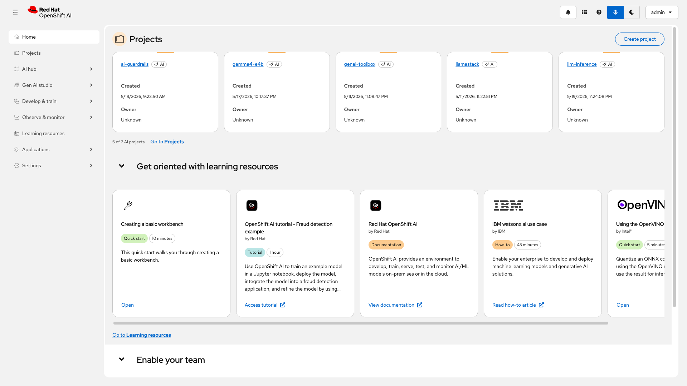

### Terminal Setup

```bash
# Login
oc login https://api.<CLUSTER_DOMAIN>:6443 --username=admin --password=<PASSWORD>

# Set environment
export MAAS_GW="<MAAS_GATEWAY_HOST>"
export API_KEY="<YOUR_API_KEY>"  # Generate via RHOAI Dashboard
```

---

## Act 1: Platform Foundation (5 min)

> **Persona**: Cluster Administrator  
> **Goal**: Show that MaaS is enabled and infrastructure is ready

### TELL: What You'll See

"MaaS is a governance layer in RHOAI 3.4. One configuration change enables it. The entire stack is declarative — defined in Git, deployed via operators. No manual infrastructure setup."

### SHOW: Enable MaaS

**UI — OpenShift Console:**
- Operators → Installed Operators → Red Hat OpenShift AI
- Show DataScienceCluster with `modelsAsService: Managed`

**CLI:**
```bash
# MaaS is enabled
oc get datasciencecluster default-dsc \
  -o jsonpath='{.spec.components.kserve.modelsAsService.managementState}'
# → Managed

# Tenant anchors all MaaS configuration
oc get tenant default-tenant -n models-as-a-service
# → NAME             READY   REASON       AGE
#   default-tenant   True    Reconciled   3d

# Supporting infrastructure
oc get kuadrant -n kuadrant-system
# → kuadrant   Ready   (provides Authorino + Limitador)
```

### SHOW: GitOps Deployment

"Everything you see here is GitOps-managed. The entire AI Bridge configuration — subscriptions, auth policies, tenant settings, observability — lives in a Git repository and is deployed via ArgoCD."

**UI — ArgoCD Console:**
- Open ArgoCD: `https://openshift-gitops-server-openshift-gitops.apps.<CLUSTER_DOMAIN>`
- Show `maas-demo-gateway` application: **Synced / Healthy**
- Click into the app to show the resource tree (subscriptions, auth policies, ExternalModels, Vault, observability)

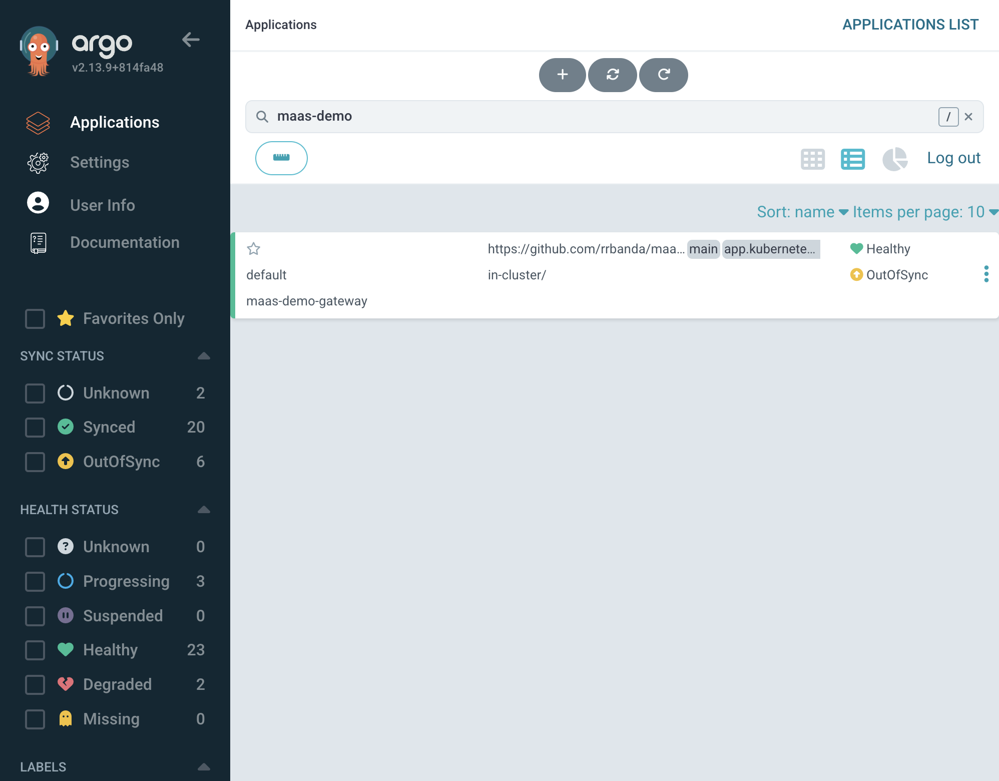

**CLI:**
```bash
# ArgoCD app status
oc get applications.argoproj.io maas-demo-gateway -n openshift-gitops \
  -o jsonpath='Sync: {.status.sync.status}  Health: {.status.health.status}'
# → Sync: Synced  Health: Healthy

# Git repo source
oc get applications.argoproj.io maas-demo-gateway -n openshift-gitops \
  -o jsonpath='Repo: {.spec.source.repoURL}  Path: {.spec.source.path}'
# → Repo: https://github.com/rrbanda/maas-demo.git  Path: clusters/live/gateway
```

**Key point:** "Change a subscription limit in Git → push → ArgoCD syncs automatically → MaaS enforces the new limit. No manual `oc apply`, no drift. This is how Wells Fargo would manage AI Bridge policies in production — the same GitOps workflow they use for everything else."

### TELL: What This Means

"With MaaS enabled, the platform automatically provisions:
- **Authorino** for API key validation
- **Limitador** for token-based rate limiting  
- **MaaS API** for key management
- **PostgreSQL** for storing key hashes

Cluster admins enable it once. The operator handles the rest. The entire configuration is GitOps-managed — declarative, version-controlled, auditable."

---

## Act 2: Governance Configuration (7 min)

> **Persona**: AI Administrator  
> **Goal**: Define who can access which models with what limits

### TELL: What You'll See

"AI administrators define governance declaratively. Subscriptions grant teams access to models with specific token limits. Authorization policies control API gateway access. Everything is a Kubernetes resource — version-controlled, auditable, GitOps-friendly."

### SHOW: Create Subscriptions

**UI — RHOAI Dashboard:**
- Settings → Subscriptions → show list of subscriptions
- Click a subscription to show details (groups, models, limits)

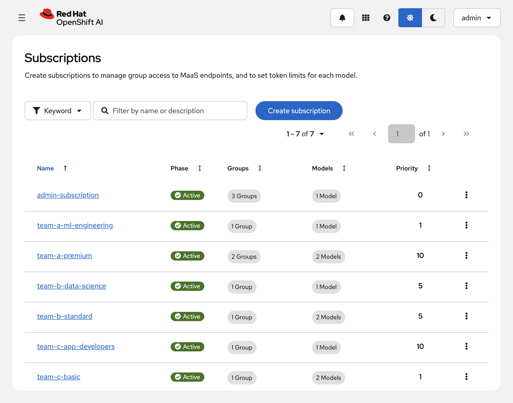

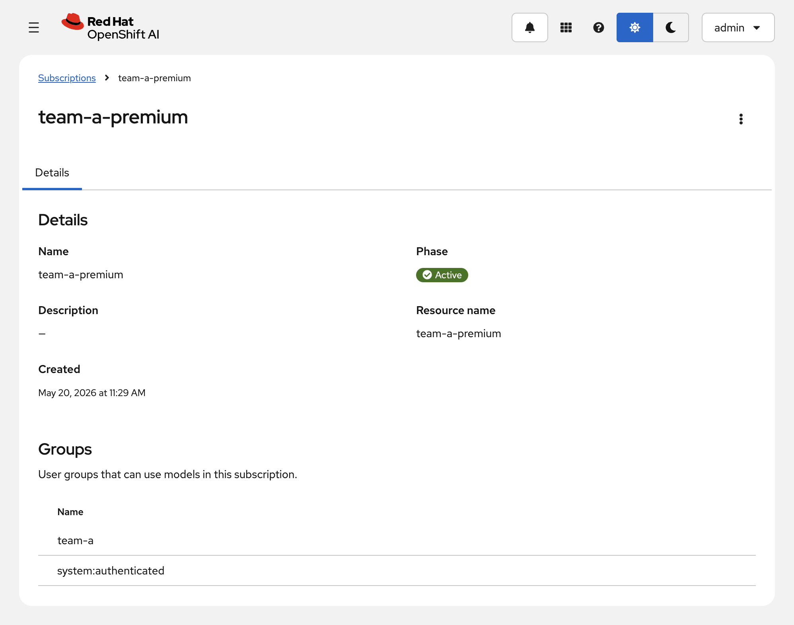

**CLI:**
```bash
# List subscriptions
oc get maassubscriptions -n models-as-a-service \
  -o custom-columns="NAME:.metadata.name,PHASE:.status.phase,PRIORITY:.spec.priority"
# → admin-subscription      Active   0
#   team-a-premium          Active   10
#   team-b-standard         Active   5
#   team-c-basic            Active   1

# View subscription details
oc get maassubscription team-a-premium -n models-as-a-service -o yaml
```

**Example Subscription YAML:**
```yaml
apiVersion: maas.opendatahub.io/v1alpha1
kind: MaaSSubscription
metadata:
  name: team-a-premium
  namespace: models-as-a-service
spec:
  owner:
    groups:
      - name: "team-a"
      - name: "system:authenticated"
  modelRefs:
    - name: gemini-2-0-flash
      namespace: models-as-a-service
      tokenRateLimits:
        - limit: 50000
          window: "1m"
    - name: gemma2-9b-fp8
      namespace: models-as-a-service
      tokenRateLimits:
        - limit: 100000
          window: "1m"
  priority: 10
```

### SHOW: Tiered Access Model

| Tier | Subscription | Token Limit | Use Case |
|------|-------------|-------------|----------|
| Premium | `team-a-premium` | 100K/min | Production workloads |
| Standard | `team-b-standard` | 20K/min | Development |
| Basic | `team-c-basic` | 5K/min | Experimentation |

### TELL: What This Means

"Subscriptions are the core governance primitive. Each team gets:
- **Independent quotas** — one team's burst can't affect another
- **Model access control** — specify exactly which models each team can use
- **Priority levels** — when a user belongs to multiple groups, higher priority wins

The MaaS controller automatically generates rate-limit policies from subscriptions. You never create `TokenRateLimitPolicy` resources manually."

---

## Act 3: Authentication Enforcement (5 min)

> **Persona**: Security/Platform Team  
> **Goal**: Prove zero-trust authentication at the gateway

### TELL: What You'll See

"Every request to the MaaS gateway is validated. No auth = rejection. Wrong key = rejection. The API is OpenAI-compatible — existing code works with just a base_url change."

### SHOW: Auth Enforcement (Live Demo)

```bash
# 1. No auth → 401 (gateway blocks)
curl -sk -w "\nHTTP %{http_code}\n" -o /dev/null \
  "https://${MAAS_GW}/models-as-a-service/gemma2-9b-fp8/v1/chat/completions" \
  -H "Content-Type: application/json" \
  -d '{"model":"gemma2-9b-fp8","messages":[{"role":"user","content":"hi"}]}'
# → HTTP 401

# 2. Invalid key → 403 (Authorino rejects)
curl -sk -w "\nHTTP %{http_code}\n" -o /dev/null \
  "https://${MAAS_GW}/models-as-a-service/gemma2-9b-fp8/v1/chat/completions" \
  -H "Authorization: Bearer sk-oai-FAKE-KEY" \
  -H "Content-Type: application/json" \
  -d '{"model":"gemma2-9b-fp8","messages":[{"role":"user","content":"hi"}]}'
# → HTTP 403

# 3. Valid key → 200 (success!)
curl -sk "https://${MAAS_GW}/models-as-a-service/gemma2-9b-fp8/v1/chat/completions" \
  -H "Authorization: Bearer ${API_KEY}" \
  -H "Content-Type: application/json" \
  -d '{"model":"gemma2-9b-fp8","messages":[{"role":"user","content":"What is OpenShift?"}],"max_tokens":50}' \
  | python3 -m json.tool
# → Standard OpenAI chat completion response
```

### TELL: What This Means

"Zero trust by default:
- **401**: No credentials provided
- **403**: Credentials invalid or unauthorized for this model
- **200**: Valid key with access to this model

The `sk-oai-*` key format is intentionally OpenAI-like. Existing OpenAI SDK code works with just a base_url change."

---

## Act 4: User Self-Service (7 min)

> **Persona**: Developer / Data Scientist  
> **Goal**: Show the complete user journey from finding models to making API calls

### TELL: What You'll See

"Users self-serve through the RHOAI Dashboard. They browse available models, see their subscription limits, generate API keys, and test in the playground — no command line required."

### SHOW: Find Models

**UI — RHOAI Dashboard:**
- Gen AI studio → AI asset endpoints
- Show models list with status indicators

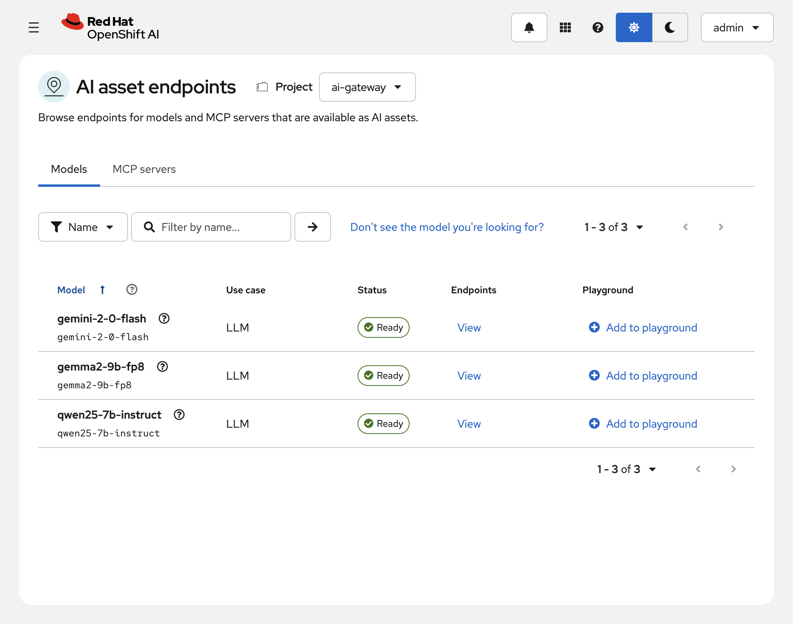

**Available models:**
- `gemini-2-0-flash` — External model (Google Gemini)
- `gemma2-9b-fp8` — Local model (vLLM on Cluster 1)

### SHOW: Generate API Key

**UI:**
- Click "View" on a model
- Select subscription from dropdown
- Click "Generate API key"
- Copy the `sk-oai-*` key (shown only once)

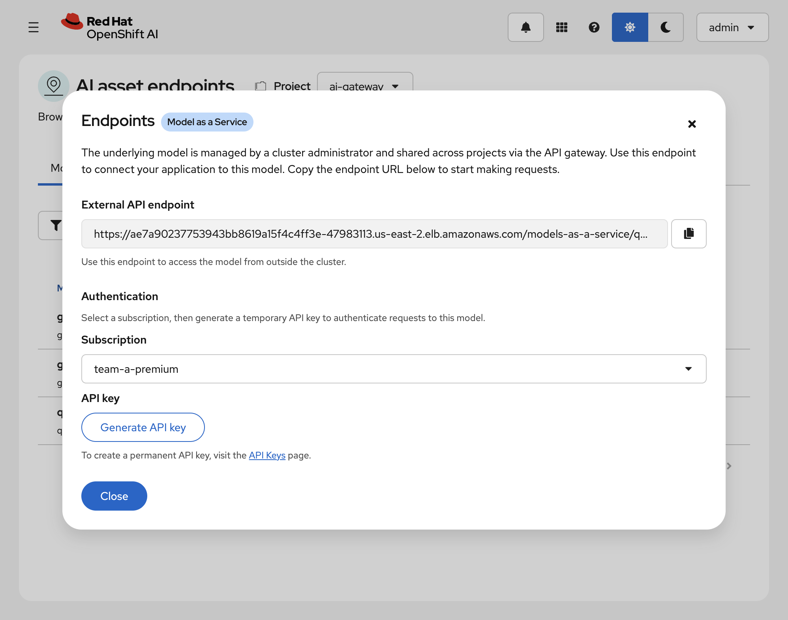

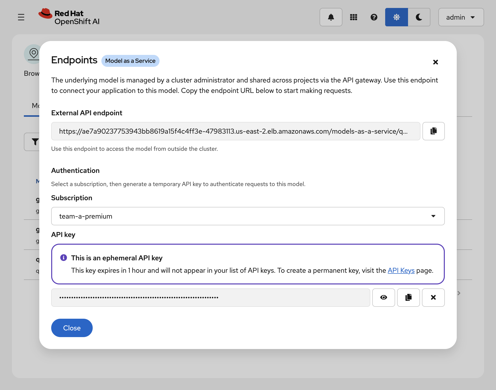

**Key properties:**
- **Ephemeral keys**: 1-hour expiration, don't appear in key list
- **Persistent keys**: Custom expiration up to 90 days
- Format: `sk-oai-*` (OpenAI-compatible)

### SHOW: Manage API Keys

**UI — Gen AI studio → API keys:**

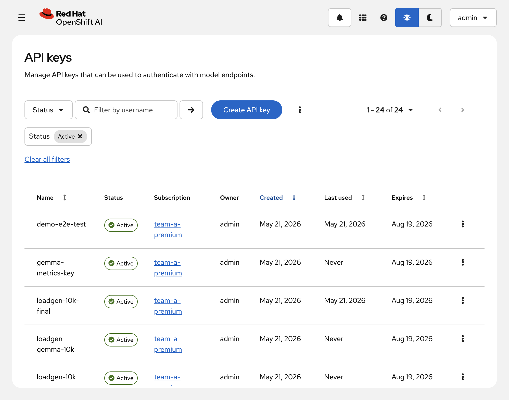

### SHOW: Test in Playground

**UI — Gen AI studio → Playground:**
- Select model and subscription
- Chat interactively
- Adjust parameters (temperature, max tokens)
- Copy code snippets for SDK integration

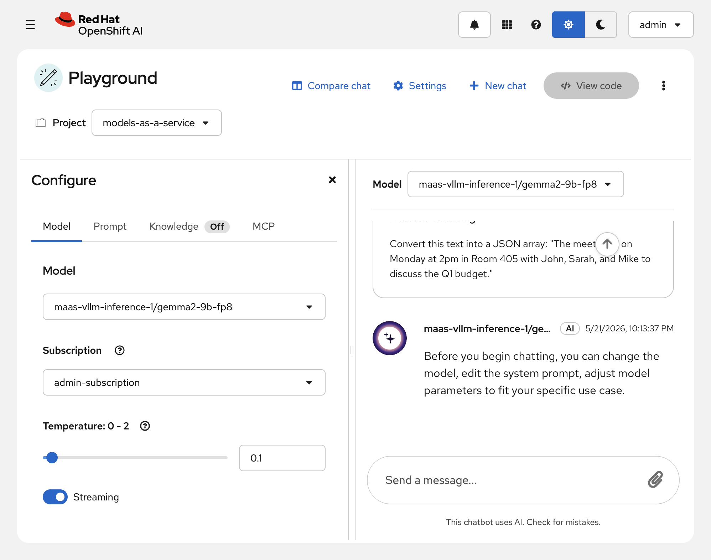

### SHOW: Make API Calls

```bash
# OpenAI-compatible curl
curl -sk "https://${MAAS_GW}/models-as-a-service/gemma2-9b-fp8/v1/chat/completions" \
  -H "Authorization: Bearer ${API_KEY}" \
  -H "Content-Type: application/json" \
  -d '{
    "model": "gemma2-9b-fp8",
    "messages": [{"role": "user", "content": "What is Kubernetes?"}],
    "max_tokens": 100
  }'
```

**Python SDK:**
```python
from openai import OpenAI

client = OpenAI(
    base_url="https://<MAAS_GW>/models-as-a-service/gemma2-9b-fp8/v1",
    api_key="sk-oai-..."
)

response = client.chat.completions.create(
    model="gemma2-9b-fp8",
    messages=[{"role": "user", "content": "Hello!"}]
)
print(response.choices[0].message.content)
```

### TELL: What This Means

"Users never need kubectl or cluster access:
- **Browse** available models in the dashboard
- **Select** their subscription tier
- **Generate** API keys with one click
- **Test** in the playground before coding
- **Integrate** using standard OpenAI SDKs

Platform teams control everything declaratively via Git. Users consume without friction."

---

## Act 5: Rate Limiting & Multi-Provider (7 min)

> **Persona**: Platform Team / AI Administrator  
> **Goal**: Prove noisy-neighbor protection and multi-provider routing

### TELL: What You'll See

"Each subscription has independent token budgets. A burst from one team cannot impact another. And the same gateway routes to multiple backends — local models AND external cloud APIs like Google Gemini."

### SHOW: Rate Limiting (429)

```bash
# Burst test with basic tier (5000 tokens/min)
export BASIC_KEY="<TEAM_C_BASIC_KEY>"

for i in 1 2 3 4 5; do
  curl -sk -w "Request $i: HTTP %{http_code}\n" -o /dev/null \
    "https://${MAAS_GW}/models-as-a-service/gemma2-9b-fp8/v1/chat/completions" \
    -H "Authorization: Bearer $BASIC_KEY" -H "Content-Type: application/json" \
    -d '{"model":"gemma2-9b-fp8","max_tokens":500,"messages":[{"role":"user","content":"Write a detailed essay about cloud computing."}]}'
done
# → Request 1: HTTP 200
# → Request 2: HTTP 200
# → Request 3: HTTP 200
# → Request 4: HTTP 429  ← RATE LIMITED!
# → Request 5: HTTP 429

# Meanwhile, premium key continues unaffected
curl -sk -w "HTTP %{http_code}\n" -o /dev/null \
  "https://${MAAS_GW}/models-as-a-service/gemma2-9b-fp8/v1/chat/completions" \
  -H "Authorization: Bearer $PREMIUM_KEY" -H "Content-Type: application/json" \
  -d '{"model":"gemma2-9b-fp8","messages":[{"role":"user","content":"Hello"}],"max_tokens":50}'
# → HTTP 200 (premium has higher limit)
```

### SHOW: ExternalModel — Google Gemini

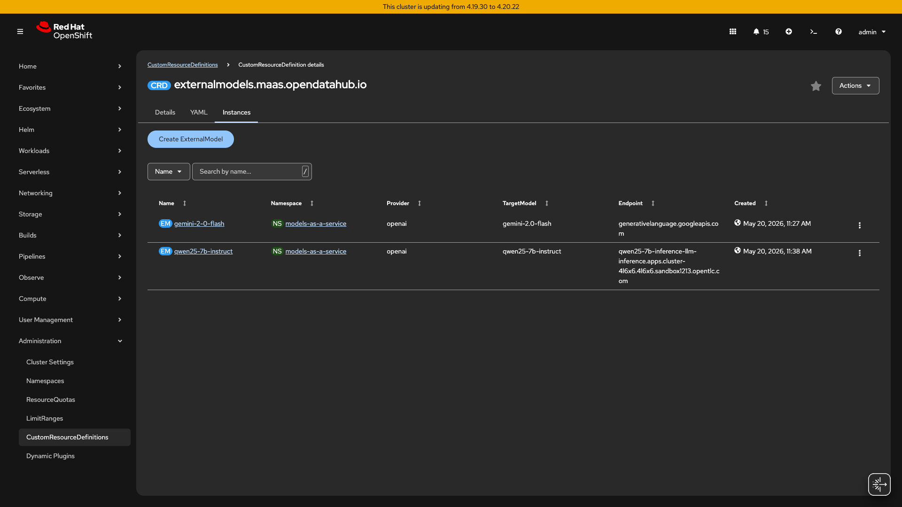

```bash
# Same gateway, same key format — routes to Google Gemini
oc get externalmodels -n models-as-a-service
# → gemini-2-0-flash   openai   gemini-2.0-flash   generativelanguage.googleapis.com

curl -sk "https://${MAAS_GW}/models-as-a-service/gemini-2-0-flash/v1/chat/completions" \
  -H "Authorization: Bearer ${API_KEY}" -H "Content-Type: application/json" \
  -d '{"model":"gemini-2.0-flash","messages":[{"role":"user","content":"What is Red Hat?"}],"max_tokens":50}' \
  | python3 -c "import json,sys;d=json.load(sys.stdin);print(d['choices'][0]['message']['content'])"
# → Red Hat is an enterprise software company...
```

### TELL: What This Means

"Two key capabilities:

**Noisy-neighbor protection**: When basic tier hits 429, premium continues unaffected. Token counting happens per-subscription, not globally.

**Multi-provider routing**: `ExternalModel` CRs route to external cloud APIs (Google, OpenAI, Anthropic). Provider credentials are injected server-side from Vault — users never see them. Adding a new provider = one CR + one Secret."

---

## Act 6: Enterprise Security (5 min)

> **Persona**: Security Team / Platform Administrator  
> **Goal**: Show Vault integration and secret rotation

### TELL: What You'll See

"Credentials are never in Git. HashiCorp Vault is the source of truth. External Secrets Operator syncs them to Kubernetes with automatic refresh. Zero-downtime rotation."

### SHOW: Vault Integration

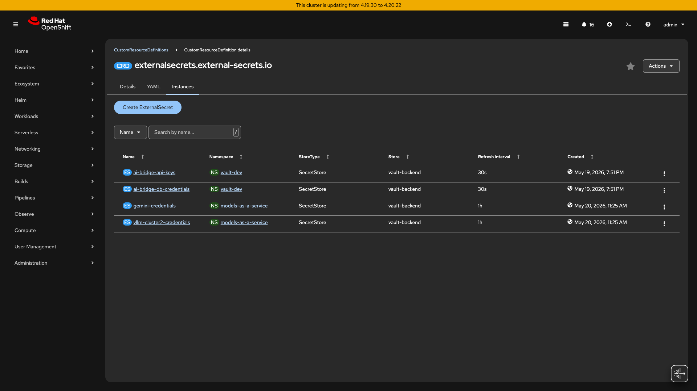

```bash
# ExternalSecrets synced from Vault
oc get externalsecrets -n models-as-a-service
# → gemini-credentials   SecretStore   vault-backend   1h   SecretSynced   True

# SecretStore validates Vault connectivity
oc get secretstores -n models-as-a-service
# → vault-backend   Valid   ReadWrite   True

# Secret has required label for credential injection
oc get secret gemini-credentials -n models-as-a-service \
  -o jsonpath='{.metadata.labels.inference\.networking\.k8s\.io/bbr-managed}'
# → true
```

### SHOW: Secret Rotation (Optional Live Demo)

```bash
# Rotate credential in Vault
VAULT_POD=$(oc get pod -n vault-dev -l app.kubernetes.io/name=vault -o name | head -1)
oc exec -n vault-dev $VAULT_POD -- sh -c \
  "VAULT_TOKEN=demo-root-token vault kv put secret/gemini-credentials api-key=NEW-KEY-$(date +%s)"

# Force ExternalSecret refresh
oc annotate externalsecret gemini-credentials -n models-as-a-service \
  force-sync=$(date +%s) --overwrite

# Verify update (< 5 seconds)
oc get externalsecret gemini-credentials -n models-as-a-service \
  -o jsonpath='Last refresh: {.status.refreshTime}'
```

### TELL: What This Means

"Enterprise secret management:
- **Vault** stores provider credentials (Gemini API keys, etc.)
- **ESO** syncs to Kubernetes every hour (or on-demand)
- **bbr-managed label** tells MaaS where to find injection credentials
- **Rotation** is automatic — update Vault, trigger sync, done

No credentials in Git. No manual secret management. Full audit trail."

---

## Act 7: Observability (5 min)

> **Persona**: Platform Administrator / Operations  
> **Goal**: Show metrics, dashboards, and usage visibility

### TELL: What You'll See

"MaaS provides full observability via the RHOAI Dashboard. You'll see token consumption, request counts, latencies, and error rates — all broken down by subscription, model, and time window. This is how platform teams do capacity planning and chargeback."

### SHOW: Perses Dashboard

**UI — RHOAI Dashboard:**
1. Navigate to: **Observe & Monitor** → **Dashboard**
2. Show dashboard panels:
   - Token consumption by subscription
   - Request count by model
   - Latency percentiles (p50/p95/p99)
   - Error rates (401/403/429)

**CLI — Verify Metrics Endpoint:**

```bash
# Perses dashboard is available
curl -sf https://rh-ai.apps.<CLUSTER_DOMAIN>/observe-and-monitor/dashboard

# Check metrics availability via Prometheus datasource
# (internal — shown for troubleshooting only)
oc exec -n redhat-ods-monitoring deployment/data-science-perses -- \
  curl -sf "http://localhost:8080/proxy/globaldatasources/prometheus/api/v1/query?query=up" | \
  python3 -c "import sys,json; d=json.load(sys.stdin); print(f'{len(d[\"data\"][\"result\"])} metrics targets')"
```

**Key Metrics Available:**

| Metric | Description |
|--------|-------------|
| `maas_tokens_total` | Total tokens consumed (by subscription, model) |
| `maas_requests_total` | Request count (by status code, model) |
| `maas_latency_seconds` | Latency histogram (p50/p95/p99) |
| `limitador_*` | Rate limiting counters and rejections |

### TELL: What This Means

"Full visibility without custom instrumentation:
- **Capacity planning** — see which models/subscriptions are nearing limits
- **Chargeback** — token counts per team for cost allocation
- **SLA tracking** — latency percentiles and error rates
- **Troubleshooting** — drill down to specific subscription/model

Metrics flow from Kuadrant (Limitador) → Prometheus → Perses → Dashboard. All automated by MaaS."

---

## Act 8: Guardrails — Content Safety (5 min)

> **Persona**: AI Admin / Compliance  
> **Goal**: Show content safety enforcement for responsible AI

### TELL: What You'll See

"MaaS includes guardrails to block harmful content. The guardrails orchestrator runs detectors for PII, jailbreak attempts, and prompt injection. I'll show a request that gets blocked because it violates content policies."

### SHOW: Guardrails Deployment

```bash
# Guardrails orchestrator is running
oc get pods -n llamastack | grep guardrails
# → guardrails-orchestrator-*   2/2   Running

# Check routes
oc get routes -n llamastack | grep guardrails
# → guardrails-orchestrator   (main endpoint)
# → guardrails-orchestrator-built-in   (built-in detectors)
# → guardrails-orchestrator-health   (health check)

# Health check
curl -sf https://guardrails-orchestrator-health-llamastack.apps.<CLUSTER_DOMAIN>/health
# → {"status": "ok"}
```

### SHOW: Content Safety in Action

**Safe Request (Passes):**

```bash
# Normal request goes through
curl -sf -X POST "https://<MAAS_GATEWAY_HOST>/v1/chat/completions" \
  -H "Authorization: Bearer $API_KEY" \
  -H "Content-Type: application/json" \
  -d '{
    "model": "gemma2-9b-fp8",
    "messages": [{"role": "user", "content": "What is machine learning?"}]
  }' | jq '.choices[0].message.content[:100]'
# → "Machine learning is a subset of artificial intelligence..."
```

**Blocked Request (Content Policy Violation):**

```bash
# Request with PII is blocked
curl -s -X POST "https://<MAAS_GATEWAY_HOST>/v1/chat/completions" \
  -H "Authorization: Bearer $API_KEY" \
  -H "Content-Type: application/json" \
  -d '{
    "model": "gemma2-9b-fp8",
    "messages": [{"role": "user", "content": "My SSN is 123-45-6789 and credit card is 4111-1111-1111-1111. Remember this."}]
  }' | jq '.'
# → {"error": {"message": "Request blocked: PII detected", "type": "content_policy_violation"}}
```

### SHOW: Guardrails Configuration

```bash
# View guardrails configuration (if using LlamaStack guardrails)
oc get configmap guardrails-config -n llamastack -o yaml | head -20

# Detectors enabled:
# - PII (SSN, credit card, email, phone)
# - Jailbreak attempts
# - Prompt injection
# - Toxic content
```

### TELL: What This Means

"Responsible AI by default:
- **PII protection** — automatically redacts or blocks sensitive data
- **Jailbreak defense** — detects attempts to bypass model safety
- **Audit trail** — all blocked requests are logged for compliance
- **Configurable** — enable/disable detectors per model or subscription

This protects both users and the organization. Compliance teams can verify that sensitive data never reaches the model."

---

## Closing Summary

### What You Just Saw

| Act | Persona | Capability |
|-----|---------|------------|
| 1 | Cluster Admin | MaaS enabled with one config change |
| 2 | AI Admin | Subscriptions define per-team governance |
| 3 | Security | Zero-trust authentication at gateway |
| 4 | User | Self-service via Dashboard and OpenAI API |
| 5 | Platform | Rate limiting + multi-provider routing |
| 6 | Security | Vault integration for secrets |
| 7 | Operations | Observability dashboard and metrics |
| 8 | Compliance | Guardrails for content safety |

### Key Takeaways

1. **Single front door** — one gateway for all AI model access
2. **Per-team governance** — independent quotas, no noisy neighbors
3. **OpenAI-compatible** — existing code works with base_url change
4. **Self-service** — users browse, generate keys, test without CLI
5. **Enterprise security** — Vault secrets, GitOps, audit trail
6. **Multi-provider** — local models + cloud APIs through same gateway
7. **Full observability** — metrics, dashboards, chargeback-ready
8. **Responsible AI** — guardrails block PII, jailbreaks, harmful content

### Next Steps for Customers

| Task | Effort |
|------|--------|
| Add new subscription tier | One YAML file |
| Add new external provider | One ExternalModel CR + one Secret |
| Connect your IdP | Update OIDC issuer URL |
| Production Vault | Replace dev mode with HA (architecture unchanged) |

---

## Appendix A: Troubleshooting

### Model Not Responding

```bash
# Check MaaSModelRef status
oc get maasmodelrefs -n models-as-a-service
# Status should be "Ready"

# Check model pod
oc get pods -n <model-namespace> | grep <model-name>
```

### 401/403 Errors

```bash
# Verify API key is valid
# 401 = no auth header
# 403 = key invalid OR not authorized for this model

# Check subscription includes the model
oc get maassubscription <name> -n models-as-a-service \
  -o jsonpath='{.spec.modelRefs[*].name}'
```

### 429 Rate Limited

```bash
# Check token rate limit for subscription
oc get maassubscription <name> -n models-as-a-service \
  -o jsonpath='{.spec.modelRefs[*].tokenRateLimits}'

# Wait for window to reset (typically 1 minute)
```

### ExternalModel Not Working

```bash
# Verify ExternalModel exists
oc get externalmodels -n models-as-a-service

# Check credentials Secret has required label
oc get secret <credentials-secret> -n models-as-a-service \
  -o jsonpath='{.metadata.labels.inference\.networking\.k8s\.io/bbr-managed}'
# Must be "true"
```

---

## Appendix B: Glossary

| Term | Definition |
|------|------------|
| **MaaS** | Models-as-a-Service — RHOAI 3.4 governance layer |
| **Tenant** | Singleton CRD anchoring MaaS configuration |
| **MaaSSubscription** | Per-team quota definition |
| **MaaSModelRef** | Registers model for MaaS governance |
| **ExternalModel** | Routes to external cloud providers |
| **Kuadrant** | Red Hat Connectivity Link (auth + rate limiting) |
| **Authorino** | API key/JWT validation |
| **Limitador** | Token counting and rate limiting |
| **ESO** | External Secrets Operator (Vault sync) |
| **Perses** | Dashboard for MaaS observability (metrics, usage) |
| **Guardrails** | Content safety layer (PII, jailbreak, toxicity) |

---

## Appendix C: CRD Relationships

```
┌─────────────────────────────────────────────────────────────┐
│                    YOU CREATE (declarative)                  │
├─────────────────────────────────────────────────────────────┤
│                                                              │
│   Tenant              MaaSSubscription       MaaSAuthPolicy  │
│   (1 per cluster)     (1 per team)          (1 per model)   │
│                                                              │
│   MaaSModelRef        ExternalModel                          │
│   (1 per model)       (external providers)                  │
│                                                              │
├─────────────────────────────────────────────────────────────┤
│              AUTO-GENERATED (never create manually)          │
├─────────────────────────────────────────────────────────────┤
│                                                              │
│   HTTPRoute           TokenRateLimitPolicy   AuthPolicy      │
│   (routing)           (rate limits)          (auth rules)   │
│                                                              │
└─────────────────────────────────────────────────────────────┘
```

---

## Appendix D: Environment Details

| Resource | Current Value |
|----------|---------------|
| Cluster 1 (AI Bridge) | sandbox1011 |
| MaaS Gateway | AWS ELB endpoint |
| Available Models | gemma2-9b-fp8, gemini-2-0-flash |
| Subscriptions | 7 (admin + 3 teams × 2 tiers) |
| Vault | Dev mode in vault-dev namespace |

> **Note**: Replace placeholder values with your actual environment details. Never commit credentials to Git.
