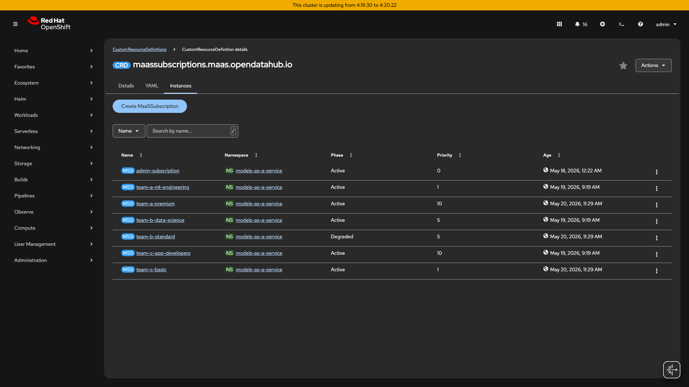

# AI Bridge Demo — Live Runbook

> **Product name**: Models-as-a-Service (MaaS) — a RHOAI 3.4 feature.
> "AI Bridge" is the PoC project name used internally.

> **How to use this doc**: Follow top-to-bottom. Each act has a talking point, a UI step, a CLI command, and the expected output. Skip acts to fit shorter timeslots.

---

## Quick Reference

### Credentials and URLs

| Tab | URL | Login |
|-----|-----|-------|
| **ArgoCD** | `https://openshift-gitops-server-openshift-gitops.apps.<CLUSTER_DOMAIN>` | admin / `<ARGOCD_PASSWORD>` |
| **RHOAI Dashboard** | `https://rh-ai.apps.<CLUSTER_DOMAIN>` | OpenShift SSO (admin / `<OCP_PASSWORD>`) |
| **OpenShift Console** | `https://console-openshift-console.apps.<CLUSTER_DOMAIN>` | htpasswd: admin / `<OCP_PASSWORD>` |
| **Keycloak** | `https://keycloak-keycloak.apps.<CLUSTER_DOMAIN>` | admin console |
| **GitHub Repo** | `https://github.com/rrbanda/maas-demo` | Public |

> **Note**: Replace `<CLUSTER_DOMAIN>`, `<OCP_PASSWORD>`, and `<ARGOCD_PASSWORD>` with your actual values. Do not commit credentials to Git.

> If clusters are re-provisioned, replace the hostnames above. The CRD names, structure, and demo flow remain the same.

### Terminal Setup

```bash
oc login https://api.<CLUSTER_DOMAIN>:6443 \
  --username=admin --password=<OCP_PASSWORD> --insecure-skip-tls-verify

export MAAS_GW="<MAAS_GATEWAY_HOST>"  # e.g., ae7a90237753943bb8619a15f4c4ff3e-*.elb.amazonaws.com
export API_KEY="<YOUR_API_KEY>"       # Generate via RHOAI Dashboard or MaaS API
```

### Timing Options

| Slot | Acts to cover |
|------|---------------|
| **60 min** | All acts (1–8 + 4.5 + 7.5) + Appendix F (Guardrails) |
| **45 min** | Acts 1–8, skip OIDC deep-dive in Act 7 |
| **30 min** | Acts 1, 3, 4, 5, 8 (core governance + ExternalModel) |
| **20 min** | Acts 1, 3, 5, 8 (quick overview) |

### PoC Success Criteria Mapping

| Act | PoC Stage | Success Criteria |
|-----|-----------|------------------|
| 1. GitOps | A | Declarative deployment via ArgoCD |
| 2. Platform + Model | A | Model available and serving |
| 3. Auth Enforcement | A/B | OpenAI-compatible + per-team auth |
| 4. Subscriptions + Rate Limits | B | Per-team isolation, token-level enforcement |
| 5. ExternalModel | C | Centralized governance over remote/external models |
| 6. Secrets | C | Zero-downtime credential rotation |
| 7. Identity | C | Enterprise identity federation |

---

## Act 1: GitOps Foundation (3 min)

**Say:** "Everything you see today is deployed from Git. ArgoCD watches two repos and reconciles 28 applications. A git commit IS the deployment — full audit trail, instant rollback, no manual steps."

**UI — ArgoCD:**
- Show the Applications tile view (28 apps visible)
- Click `maas-demo-gateway` → source: `github.com/rrbanda/maas-demo`, path `clusters/live/gateway`, branch `main`
- Point out the ApplicationSets: `cluster-operators`, `cluster-instances`, `cluster-models`, `cluster-services`


**UI — GitHub:**
- Open `https://github.com/rrbanda/maas-demo` → show `clusters/live/`, `manifests/`, `profiles/`

**CLI:**
```bash
oc get application.argoproj.io -n openshift-gitops --no-headers | wc -l
# → 28

oc get application.argoproj.io maas-demo-gateway -n openshift-gitops \
  -o jsonpath='Repo: {.spec.source.repoURL}{"\n"}Path: {.spec.source.path}{"\n"}Rev:  {.spec.source.targetRevision}{"\n"}'
# → Repo: https://github.com/rrbanda/maas-demo.git
#   Path: clusters/live/gateway
#   Rev:  main
```

**Takeaway:** Two repos manage the full stack — `maas-demo` for demo resources, `rhoai-deploy-gitops` for platform operators. No imperative steps exist.

---

## Act 2: Platform + Model (3 min)

**Say:** "RHOAI 3.4 introduces MaaS as a governance layer. One config change enables it. The AI Bridge can serve local models AND route to remote GPU clusters or cloud APIs via ExternalModel. All access is governed centrally."

**UI — OpenShift Console:**
- Navigate: Operators → Installed Operators → show RHOAI 3.4, Red Hat Connectivity Link, External Secrets Operator
- Navigate: Search → `Tenant` → show `default-tenant` in `models-as-a-service` namespace (Status: Ready)

**CLI:**
```bash
# MaaS is enabled
oc get datasciencecluster default-dsc \
  -o jsonpath='{.spec.components.kserve.modelsAsService.managementState}'
# → Managed

# Tenant anchors all MaaS config
oc get tenant default-tenant -n models-as-a-service
# → NAME             READY   REASON       AGE
#   default-tenant   True    Reconciled   3d

# Model running on Cluster 2 (GPU)
oc login https://api.<INFERENCE_CLUSTER_DOMAIN>:6443 \
  --username=admin --password=<INFERENCE_OCP_PASSWORD> --insecure-skip-tls-verify
oc get pods -n llm-inference --no-headers | grep Running
# → qwen25-7b-instruct-kserve-*   1/1   Running

# Switch back to AI Bridge
oc login https://api.<CLUSTER_DOMAIN>:6443 \
  --username=admin --password=<OCP_PASSWORD> --insecure-skip-tls-verify
```

**Takeaway:** AI Bridge (Cluster 1) = centralized governance. It can serve local models AND route to Cluster 2 (GPU inference) and cloud APIs via `ExternalModel` CRs (shown in Act 5).

---

## Act 3: Auth Enforcement (4 min)

**Say:** "Every request to the MaaS gateway is validated. No auth means rejection. Wrong key means rejection. The API is OpenAI-compatible — consumers change only the `base_url`."

**CLI (do this live — the money shot):**
```bash
# 1. No auth → 401 (gateway blocks)
curl -sk -w "\nHTTP %{http_code}\n" -o /dev/null \
  "https://${MAAS_GW}/models-as-a-service/qwen25-7b-instruct/v1/chat/completions" \
  -H "Content-Type: application/json" \
  -d '{"model":"qwen25-7b-instruct","messages":[{"role":"user","content":"hi"}]}'
# → HTTP 401

# 2. Invalid key → 403 (Authorino rejects)
curl -sk -w "\nHTTP %{http_code}\n" -o /dev/null \
  "https://${MAAS_GW}/models-as-a-service/qwen25-7b-instruct/v1/chat/completions" \
  -H "Authorization: Bearer sk-oai-FAKE-KEY" \
  -H "Content-Type: application/json" \
  -d '{"model":"qwen25-7b-instruct","messages":[{"role":"user","content":"hi"}]}'
# → HTTP 403

# 3. Valid key → 200 (cross-cluster inference!)
curl -sk "https://${MAAS_GW}/models-as-a-service/qwen25-7b-instruct/v1/chat/completions" \
  -H "Authorization: Bearer ${API_KEY}" \
  -H "Content-Type: application/json" \
  -d '{"model":"qwen25-7b-instruct","messages":[{"role":"user","content":"What is OpenShift? One sentence."}],"max_tokens":50}' \
  | python3 -m json.tool
# → Standard OpenAI chat completion response
```

**Takeaway:** Zero trust by default. The `sk-oai-*` key format is intentionally OpenAI-like — existing code works with just a `base_url` change.

---

## Act 4: Subscriptions + Rate Limits (4 min)

**Say:** "Each team gets its own subscription with independent token budgets. A burst from one team cannot impact another. The MaaS controller auto-generates rate-limit policies from your subscription YAML — you never create them manually."

**UI — OpenShift Console:**
- Search → `MaaSSubscription` → namespace `models-as-a-service`
- Show 7 subscriptions with different phases and priorities



**CLI:**
```bash
# Tiered subscriptions
oc get maassubscriptions -n models-as-a-service \
  -o custom-columns="NAME:.metadata.name,PHASE:.status.phase,PRIORITY:.spec.priority"
# → admin-subscription      Active   0
#   team-a-premium          Active   10
#   team-b-standard         Active   5
#   team-c-basic            Active   1
#   ... (7 total)

# Auto-generated rate limits (never created manually)
oc get tokenratelimitpolicy maas-trlp-qwen25-7b-instruct -n models-as-a-service \
  -o yaml | grep -E "limit:|window:" | head -6
# → team-a-premium: 100,000 tokens/min
# → team-b-standard: 20,000 tokens/min
# → team-c-basic: 5,000 tokens/min
```

**Live Proof — Rate Limit 429:**
```bash
# Burst test: team-c-basic subscription (5000 tokens/min for qwen25-7b-instruct)
# Send large-prompt requests (~1138 tokens each) until limit is hit:

export TEAM_C_KEY="<TEAM_C_API_KEY>"  # team-c-basic subscription key (generate via Dashboard)

for i in 1 2 3 4 5; do
  curl -sk -o /tmp/r$i.json -w "Request $i: HTTP %{http_code}\n" \
    "https://${MAAS_GW}/models-as-a-service/qwen25-7b-instruct/v1/chat/completions" \
    -H "Authorization: Bearer $TEAM_C_KEY" -H "Content-Type: application/json" \
    -d '{"model":"qwen25-7b-instruct","max_tokens":100,"messages":[{"role":"user","content":"<large prompt ~1000 tokens>"}]}'
done
# → Request 1: HTTP 200 (Tokens: 1138)
# → Request 2: HTTP 200 (Tokens: 1138)
# → Request 3: HTTP 200 (Tokens: 1138)
# → Request 4: HTTP 200 (Tokens: 1138)
# → Request 5: HTTP 429   ← RATE LIMITED! (4552/5000 tokens consumed)

# Meanwhile, premium-tier key continues unaffected:
curl -sk -w "HTTP %{http_code}\n" \
  "https://${MAAS_GW}/models-as-a-service/qwen25-7b-instruct/v1/chat/completions" \
  -H "Authorization: Bearer $PREMIUM_KEY" -H "Content-Type: application/json" \
  -d '{"model":"qwen25-7b-instruct","messages":[{"role":"user","content":"Hello"}],"max_tokens":50}'
# → HTTP 200 (premium has 100,000 tokens/min — unaffected)
```

**Takeaway:** Three tiers, independent budgets. When basic hits its limit (HTTP 429), premium continues unaffected. This is noisy-neighbor protection at the token level.

---

## Act 4.5: Self-Service via RHOAI Dashboard (3 min)

**Say:** "Platform teams define subscriptions in Git. Consumers self-serve through the RHOAI Dashboard — browse available models, see their tier limits, and generate API keys without touching the command line."

**UI — RHOAI Dashboard:**
- Open `https://rh-ai.apps.<CLUSTER_DOMAIN>`
- Navigate to **Gen AI studio** → **AI asset endpoints** → **Models as a service** tab
- Show the models list: `qwen25-7b-instruct`, `gemini-2-0-flash`, `gemma2-9b-fp8`
- Click "View" on `qwen25-7b-instruct` → show the MaaS route and subscription details
- Click "Generate API Key" → show the key generation dialog
- Point out "Tier information" showing the token budget per subscription


**Takeaway:** End users never need `kubectl`. The RHOAI Dashboard provides a complete self-service experience — model catalog, key generation, tier visibility. Platform teams control everything declaratively via Git.

---

## Act 5: ExternalModel — Multi-Provider (5 min)

**Say:** "The AI Bridge's primary role is centralized governance. While it CAN run local models (like `gemma2-9b-fp8` in this demo), the key pattern is using `ExternalModel` CRs to route to any backend — a remote GPU cluster, or a cloud API like Gemini. Same API key, same URL pattern, same governance. The consumer never knows where the model runs."

**UI — OpenShift Console:**
- Search → `ExternalModel` → namespace `models-as-a-service`
- Show 2 CRs: `qwen25-7b-instruct` (→ Cluster 2 vLLM) and `gemini-2-0-flash` (→ Google)


**CLI:**
```bash
# ExternalModel CRs
oc get externalmodels -n models-as-a-service \
  -o custom-columns="NAME:.metadata.name,PROVIDER:.spec.provider,TARGET:.spec.targetModel,ENDPOINT:.spec.endpoint"
# → gemini-2-0-flash     openai   gemini-2.0-flash     generativelanguage.googleapis.com
#   qwen25-7b-instruct   openai   qwen25-7b-instruct   qwen25-7b-inference-llm-inference.apps.<INFERENCE_CLUSTER>...

# Cross-cluster vLLM inference (same API key!)
curl -sk "https://${MAAS_GW}/models-as-a-service/qwen25-7b-instruct/v1/chat/completions" \
  -H "Authorization: Bearer ${API_KEY}" -H "Content-Type: application/json" \
  -d '{"model":"qwen25-7b-instruct","messages":[{"role":"user","content":"What is Kubernetes?"}],"max_tokens":50}' \
  | python3 -c "import json,sys;d=json.load(sys.stdin);print(f'Model: {d[\"model\"]}\nResponse: {d[\"choices\"][0][\"message\"][\"content\"]}')"
# → Model: qwen25-7b-instruct
#   Response: Kubernetes is an open-source container orchestration platform...

# Gemini via the SAME gateway, SAME key
curl -sk "https://${MAAS_GW}/models-as-a-service/gemini-2-0-flash/v1/chat/completions" \
  -H "Authorization: Bearer ${API_KEY}" -H "Content-Type: application/json" \
  -d '{"model":"gemini-2.0-flash","messages":[{"role":"user","content":"What is Red Hat OpenShift AI?"}],"max_tokens":50}' \
  | python3 -c "import json,sys;d=json.load(sys.stdin);print(f'Model: {d[\"model\"]}\nResponse: {d[\"choices\"][0][\"message\"][\"content\"]}')"
# → Model: gemini-2.0-flash
#   Response: Red Hat OpenShift AI is a hybrid MLOps platform...
```

**Takeaway:** One gateway, any backend. Provider credentials are injected server-side from Vault — consumers never see them. Adding a new backend = one `ExternalModel` CR + one Secret. Zero consumer-side changes.

---

## Act 6: Enterprise Secrets (3 min)

**Say:** "Credentials are never in Git. HashiCorp Vault is the source of truth. The External Secrets Operator syncs them to Kubernetes automatically with a 1-hour refresh cycle. Zero-downtime rotation."

**UI — OpenShift Console:**
- Search → `ExternalSecret` → namespace `models-as-a-service`
- Show 2 ExternalSecrets: `gemini-credentials` and `vllm-cluster2-credentials` (Status: SecretSynced)


**CLI:**
```bash
# ExternalSecrets synced from Vault
oc get externalsecrets -n models-as-a-service
# → gemini-credentials          SecretStore   vault-backend   1h    SecretSynced   True
#   vllm-cluster2-credentials   SecretStore   vault-backend   1h    SecretSynced   True

# SecretStore validates Vault connectivity
oc get secretstores -n models-as-a-service
# → vault-backend   Valid   ReadWrite   True

# Critical label required for credential injection
oc get secret gemini-credentials -n models-as-a-service \
  -o jsonpath='{.metadata.labels.inference\.networking\.k8s\.io/bbr-managed}'
# → true

# Last sync time (proves auto-rotation)
oc get externalsecret gemini-credentials -n models-as-a-service \
  -o jsonpath='Last refresh: {.status.refreshTime}'
# → Last refresh: 2026-05-21T16:25:55Z
```

**Live Proof — Secret Rotation:**
```bash
# Step 1: Current K8s secret value
oc get secret vllm-cluster2-credentials -n models-as-a-service \
  -o jsonpath='{.data.api-key}' | base64 -d
# → not-required-direct-access

# Step 2: Rotate in Vault
VAULT_POD=$(oc get pod -n vault-dev -l app.kubernetes.io/name=vault -o name | head -1)
oc exec -n vault-dev $VAULT_POD -- sh -c \
  "VAULT_TOKEN=demo-root-token vault kv put secret/vllm-cluster2-credentials api-key=ROTATED-key-$(date +%s)"
# → Success (version 2)

# Step 3: Force ExternalSecret refresh
oc annotate externalsecret vllm-cluster2-credentials -n models-as-a-service \
  force-sync=$(date +%s) --overwrite
# → externalsecret annotated

# Step 4: Verify (< 5 seconds!)
oc get secret vllm-cluster2-credentials -n models-as-a-service \
  -o jsonpath='{.data.api-key}' | base64 -d
# → ROTATED-key-1779391511  ← Updated automatically!
```

**Takeaway:** Vault stores provider credentials. ESO syncs them every hour (or instantly on annotation). The `bbr-managed=true` label tells the MaaS credential injection plugin where to find them. Rotation is automatic — update Vault, trigger sync, done in seconds.

---

## Act 7: Identity Federation (3 min)

**Say:** "API keys are for automation. For human operators, MaaS supports OIDC/SSO. The same enterprise identity that logs into internal tools accesses models. Dual auth — both enforced at the gateway."

**UI — Keycloak Admin:**
- Open `https://keycloak-keycloak.apps.<CLUSTER_DOMAIN>/admin/`
- Show the `ai-bridge` realm
- Navigate to Clients → show `ai-bridge-gateway` client (OIDC client configured for the MaaS gateway)


**CLI:**
```bash
# Keycloak OIDC discovery
KC_HOST="keycloak-keycloak.apps.<CLUSTER_DOMAIN>"
curl -sk "https://${KC_HOST}/realms/ai-bridge/.well-known/openid-configuration" \
  | python3 -c "import json,sys;d=json.load(sys.stdin);print(f'Issuer: {d[\"issuer\"]}')"
# → Issuer: https://keycloak-keycloak.apps.<CLUSTER_DOMAIN>/realms/ai-bridge

# Get OIDC token (client credentials flow)
TOKEN=$(curl -sk "https://${KC_HOST}/realms/ai-bridge/protocol/openid-connect/token" \
  -d "grant_type=client_credentials&client_id=ai-bridge-gateway&client_secret=ai-bridge-secret-2026" \
  | python3 -c "import json,sys;print(json.load(sys.stdin)['access_token'])")
echo "Token: ${TOKEN:0:30}... (${#TOKEN} chars)"
# → Token: eyJhbGciOiJSUzI1NiIsInR5cCIgOi... (1085 chars)
```

**Takeaway:** Dual auth model — `sk-oai-*` keys for CI/CD and SDKs, OIDC tokens for humans and dashboards. Both validated at the gateway. Swap Keycloak for Okta/Azure AD with a config change.

---

## Act 7.5: Observability — Perses Dashboard (2 min)

**Say:** "Every request through the AI Bridge is observable. The Cluster Observability Operator provides native Perses dashboards directly in the OpenShift Console — request rates, latency percentiles, and rate-limited events by model and subscription."

**UI — OpenShift Console:**
- Navigate to **Observe → Dashboards**
- Select the **MaaS AI Bridge - Gateway Metrics** dashboard
- Show 4 panels: Total API Requests, Requests by Model, Rate Limited (429), Request Latency (p99)


**CLI:**
```bash
# Cluster Observability Operator deployed
oc get csv -n openshift-cluster-observability-operator | grep observability
# → cluster-observability-operator.v1.4.0   Succeeded

# PersesDashboard CR in models-as-a-service namespace
oc get persesdashboard -n models-as-a-service
# → maas-ai-bridge-metrics   (shows in Console under Observe → Dashboards)

# UIPlugin enables the dashboard in OpenShift Console
oc get uiplugin
# → dashboards   (enables Observe → Dashboards menu)
```

**Takeaway:** Observability is built in. The Perses dashboard gives platform teams real-time visibility into API usage, rate limiting events, and latency — without external tools.

---

## Act 8: Closing (2 min)

**Architecture:**
```
┌─────────────────────────────────────────────────────────────────┐
│              Cluster 1 — AI Bridge (No GPUs)                     │
│                                                                  │
│  Consumer → MaaS Gateway → Authorino → Limitador → ExternalModel│
│                                              │           │       │
│                                              ▼           ▼       │
│                                         Cluster 2    Google      │
│                                         (vLLM+GPU)   Gemini      │
└─────────────────────────────────────────────────────────────────┘
```

**What you just saw:**
1. **GitOps-managed** — 28 ArgoCD apps from 2 repos, zero manual steps
2. **Zero-trust auth** — every request validated (API key or OIDC)
3. **Multi-cluster + multi-provider** — one gateway, any backend via ExternalModel
4. **Token-based rate limiting** — per-team budgets, noisy-neighbor protection (live 429 proof)
5. **Vault-synced secrets** — auto-rotation in seconds, never in Git (live rotation proof)
6. **OpenAI-compatible** — change `base_url` only
7. **Self-service** — teams generate keys via RHOAI Dashboard
8. **Observable** — Perses dashboards for real-time gateway metrics

**Next steps for the customer:**
- Adding a new model backend = one `ExternalModel` CR + one Secret
- Connecting your IdP = change the OIDC issuer URL
- Production Vault = swap dev mode for HA deployment (architecture unchanged)

---
---

## Appendix A: API Key Generation

### Method 1: RHOAI Dashboard (recommended)

1. Open the RHOAI Dashboard (see URL in Quick Reference)
2. Navigate to Models as a Service section
3. Select a subscription (e.g., `team-a-premium`)
4. Click "Generate API Key"
5. Copy the `sk-oai-*` key — it will not be shown again

### Method 2: CLI (fallback)

```bash
# Port-forward to internal MaaS API
oc port-forward svc/maas-api -n redhat-ods-applications 9443:8443 &
sleep 3

# Create a key (requires these exact headers)
curl -sk -X POST "https://localhost:9443/v1/api-keys" \
  -H "Authorization: Bearer $(oc whoami -t)" \
  -H "X-MaaS-Username: admin" \
  -H 'X-MaaS-Group: ["system:cluster-admins","system:authenticated:oauth","system:authenticated"]' \
  -H "Content-Type: application/json" \
  -d '{"subscription":"team-a-premium","name":"demo-key"}'
# → {"key":"sk-oai-<GENERATED_KEY>","subscription":"team-a-premium",...}

# Kill port-forward
kill %1
```

Key details:
- `X-MaaS-Group` must be a **JSON array** (not comma-separated)
- `name` field is required for non-ephemeral keys
- Keys are scoped to the subscription's `modelRefs` — the key only works for models in that subscription

---

## Appendix B: Fallback Commands

If something fails during the live demo:

```bash
# If model isn't responding, test vLLM directly on Cluster 2
oc login https://api.<INFERENCE_CLUSTER_DOMAIN>:6443 \
  --username=admin --password=<INFERENCE_OCP_PASSWORD> --insecure-skip-tls-verify
oc port-forward -n llm-inference svc/qwen25-7b-instruct-kserve-workload-svc 8443:8000 &
sleep 2
curl -sk https://localhost:8443/v1/models
kill %1

# If MaaS gateway isn't accessible, test via internal service
oc port-forward -n openshift-ingress svc/maas-default-gateway-data-science-gateway-class 9443:443 &
sleep 2
curl -sk https://localhost:9443/models-as-a-service/qwen25-7b-instruct/v1/chat/completions \
  -H "Authorization: Bearer ${API_KEY}" -H "Content-Type: application/json" \
  -d '{"model":"qwen25-7b-instruct","messages":[{"role":"user","content":"hi"}],"max_tokens":5}'
kill %1

# If subscriptions aren't Active, check Tenant first
oc get tenant default-tenant -n models-as-a-service -o yaml

# If MaaSModelRef isn't Ready, check conditions
oc get maasmodelref qwen25-7b-instruct -n models-as-a-service \
  -o jsonpath='{.status.conditions}' | python3 -m json.tool

# If ExternalModel credentials aren't injecting, check the label
oc get secret gemini-credentials -n models-as-a-service \
  -o jsonpath='{.metadata.labels.inference\.networking\.k8s\.io/bbr-managed}'
# Must be "true"

# If Vault rotation is slow, check ExternalSecret status
oc get externalsecrets -n models-as-a-service -o wide
```

---

## Appendix C: Glossary

| Term | What it is | Why it matters |
|------|-----------|----------------|
| **RHOAI** | Red Hat OpenShift AI — the AI/ML platform | Provides the operator that installs and manages MaaS |
| **MaaS** | Models-as-a-Service — RHOAI 3.4 governance layer | Turns raw GPU endpoints into managed API products |
| **Tenant** | Singleton CRD in `models-as-a-service` namespace | Anchors the MaaS config: binds gateway, sets key expiration policy |
| **MaaSModelRef** | CRD that registers a model for governance | Model not accessible via MaaS until this exists and is Ready |
| **MaaSSubscription** | CRD defining per-team quota | Each team gets isolated access with independent rate limits |
| **ExternalModel** | CRD routing to a remote/external model endpoint | Enables multi-cluster and multi-provider via one gateway |
| **Kuadrant** | Red Hat Connectivity Link (RHCL) | Provides auth + rate limiting framework that MaaS builds on |
| **Authorino** | Kuadrant's auth engine | Validates API keys and JWT tokens on every request |
| **Limitador** | Kuadrant's rate limiting engine | Counts tokens per subscription, enforces limits |
| **TokenRateLimitPolicy** | Auto-generated CRD (by MaaS controller) | Never create manually — generated from subscription specs |
| **Gateway API** | K8s-native API (`gateway.networking.k8s.io`) | Required because Kuadrant policies attach to HTTPRoute |
| **`sk-oai-`** | API key prefix for MaaS-generated keys | Intentionally similar to OpenAI's format |

---

## Appendix D: CRD Relationships

```
┌─────────────────────────────────────────────────────────────────────────┐
│                        YOU CREATE (declarative YAML)                     │
├─────────────────────────────────────────────────────────────────────────┤
│                                                                         │
│   Tenant                 MaaSSubscription         MaaSAuthPolicy        │
│   (1 per cluster)        (1 per team)             (1 per model)         │
│   ┌──────────────┐       ┌──────────────────┐     ┌────────────────┐   │
│   │ gatewayRef   │       │ owner: [groups]  │     │ modelRef       │   │
│   │ maxExpDays   │       │ modelRefs:       │     │ allowedGroups  │   │
│   │              │       │   tokenRateLimits│     │                │   │
│   └──────┬───────┘       │   priority       │     └────────┬───────┘   │
│          │               └────────┬─────────┘              │           │
│          │                        │                        │           │
│   MaaSModelRef ◄──────────────────┼────────────────────────┘           │
│   (1 per model)                   │                                    │
│   ┌──────────────┐                │                                    │
│   │ model name   │                │                                    │
│   │ namespace    │                │                                    │
│   └──────────────┘                │                                    │
│                                   │                                    │
├───────────────────────────────────┼────────────────────────────────────┤
│             MaaS CONTROLLER AUTO-GENERATES (never create manually)      │
├───────────────────────────────────┼────────────────────────────────────┤
│                                   │                                    │
│                                   ▼                                    │
│   HTTPRoute              TokenRateLimitPolicy        AuthPolicy        │
│   (gateway.networking    (kuadrant.io/v1alpha1)      (kuadrant.io/     │
│    .k8s.io/v1)                                        v1beta2)         │
│   ┌──────────────┐       ┌──────────────────┐     ┌────────────────┐  │
│   │ routes /v1/* │       │ per-subscription │     │ API key        │  │
│   │ to model pod │       │ token counting   │     │ validation via │  │
│   │              │       │ via Limitador    │     │ Authorino      │  │
│   └──────────────┘       └──────────────────┘     └────────────────┘  │
│                                                                        │
└────────────────────────────────────────────────────────────────────────┘

Key rule: MaaSModelRef becomes "Ready" ONLY when:
  1. Tenant exists and is Active
  2. At least one MaaSSubscription references this model
  3. At least one MaaSAuthPolicy covers this model
  4. The model backend is reachable (local pod Running, or ExternalModel endpoint accessible)
```

---

## Appendix E: Prerequisites

| Requirement | Cluster 1 (AI Bridge) | Cluster 2 (Inference) |
|-------------|----------------------|----------------------|
| OpenShift 4.18+ | Yes | Yes |
| RHOAI 3.4 | Yes (MaaS governance) | Yes (model serving) |
| Red Hat Connectivity Link | Yes (Authorino + Limitador) | No |
| Service Mesh 3 | Yes (Gateway API provider) | No |
| NVIDIA GPU Operator | No | Yes |
| External Secrets Operator | Yes | No |
| HashiCorp Vault | Yes (dev mode) | No |
| Keycloak | Yes (OIDC provider) | No |

---

## Appendix F: Bonus — Guardrails (PII Detection)

> Optional section. Skip unless time allows.

**Say:** "Content safety can be layered inline without changing the model."

**CLI:**
```bash
# Passthrough (no filtering)
GUARDRAILS_HOST=$(oc get route guardrails-gateway -n ai-guardrails -o jsonpath='{.spec.host}' 2>/dev/null)
curl -sk "http://${GUARDRAILS_HOST}/passthrough/v1/chat/completions" \
  -H "Content-Type: application/json" \
  -d '{"model":"qwen25-7b-instruct","messages":[{"role":"user","content":"What is 2+2?"}],"max_tokens":20}'
# → Normal response

# PII detection
curl -sk "http://${GUARDRAILS_HOST}/pii/v1/chat/completions" \
  -H "Content-Type: application/json" \
  -d '{"model":"qwen25-7b-instruct","messages":[{"role":"user","content":"My SSN is 123-45-6789"}],"max_tokens":50}'
# → Response with PII detections flagged
```

---

## Appendix G: llm-d Intelligent Routing

### What is llm-d?

llm-d (LLM Daemon) is the inference scheduler component that provides intelligent request routing across vLLM replicas. It uses the Gateway API Inference Extension (`InferencePool` and `InferenceModel` CRDs) to make routing decisions based on:

- **KV cache utilization** — routes to replicas with available cache capacity
- **Queue depth** — avoids overloaded replicas
- **Load balancing** — distributes requests optimally across replicas

### Current Deployment Status

| Component | Status |
|-----------|--------|
| llm-d EPP Pod | Running |
| InferencePool CRD | Deployed |
| InferenceModel CRD | Deployed |
| vLLM pod tracking | Active |
| HTTPRoute integration | **Not yet supported** |

### Why llm-d isn't in the traffic path (yet)

The OpenShift gateway controller doesn't currently support `InferencePool` as an HTTPRoute backendRef. When you create an HTTPRoute with:

```yaml
backendRefs:
  - group: inference.networking.k8s.io
    kind: InferencePool
    name: qwen25-7b-pool
```

The controller reports: `referencing unsupported backendRef: group "inference.networking.k8s.io" kind "InferencePool"`

**Current flow:** AI Bridge → ExternalModel → vLLM Route → vLLM (direct)

**Target flow (when integrated):** AI Bridge → ExternalModel → llm-d HTTPRoute → InferencePool → optimal vLLM replica

### Verification Commands

```bash
# Check llm-d EPP health
oc get pods -n llm-inference -l app=llm-d-epp

# Check InferencePool
oc get inferencepool -n llm-inference

# Check InferenceModel
oc get inferencemodel -n llm-inference

# View llm-d logs (shows pod tracking)
oc logs -n llm-inference deployment/llm-d-epp --tail=20
```

### When llm-d matters

llm-d becomes valuable when:
- You have **multiple vLLM replicas** (scaling for throughput)
- You need **KV cache-aware routing** (avoiding cache misses)
- You want **intelligent load balancing** (beyond round-robin)

For single-replica deployments (like this demo), traffic goes directly to vLLM without significant routing benefit.

---

## Environment Details (for reference)

| Resource | Value Template |
|----------|----------------|
| Cluster 1 (AI Bridge) API | `https://api.<CLUSTER_DOMAIN>:6443` |
| Cluster 2 (Inference) API | `https://api.<INFERENCE_CLUSTER_DOMAIN>:6443` |
| MaaS Gateway (ELB) | `<MAAS_GATEWAY_HOST>` (e.g., `*.elb.amazonaws.com`) |
| vLLM Route (Cluster 2) | `<MODEL>-llm-inference.apps.<INFERENCE_CLUSTER_DOMAIN>` |
| Keycloak Issuer | `https://keycloak-keycloak.apps.<CLUSTER_DOMAIN>/realms/ai-bridge` |
| Vault (internal) | `http://vault.vault-dev.svc:8200` |
| ArgoCD Apps | 28+ (from `maas-demo` + `rhoai-deploy-gitops` repos) |
| Subscriptions | 7 (admin + 3 teams x 2 tiers) |
| ExternalModels | 2 (qwen25-7b-instruct, gemini-2-0-flash) |

> **Note**: Replace `<CLUSTER_DOMAIN>`, `<INFERENCE_CLUSTER_DOMAIN>`, and `<MAAS_GATEWAY_HOST>` with actual values for your environment.
