# Gaps & Production Considerations

This document outlines the differences between this demo environment and a production deployment.

---

## Demo vs Production

| Area | Demo Environment | Production Target | Gap |
|------|------------------|-------------------|-----|
| Network | Connected (public internet) | Disconnected (internal registry mirror) | Images pulled from registry.redhat.io; production needs mirror config |
| TLS | Self-signed certs on MaaS gateway | cert-manager with proper CA | Production needs valid certificates |
| Auth enforcement | Permissive mode (allows unauthenticated) | Strict (all requests require valid key/token) | MaaS controller tightens policy once subscriptions are reconciled |
| Identity Provider | Standalone Keycloak (demo realm) | Enterprise IdP (Okta/Azure AD/ADFS) | Config change only — AuthConfig issuerUrl points to customer IdP |
| Vault | Dev mode (in-memory, ephemeral) | Production HA Vault with persistent storage | Architecture identical; only deployment mode differs |
| Rate limiting | Configured in manifests | Enforced with real traffic patterns | Limitador counters active; production tuning needed for actual TPM values |
| Multi-cluster | Two clusters (same region) | Cross-site (GPU + CPU clusters) | Network topology changes; Istio config pattern is the same |
| Observability | Prometheus + ServiceMonitors | Grafana/Perses dashboards + alerting + federation | Dashboard JSON ready; needs Grafana instance and alert rules |
| API management | Direct access to AI Bridge | End users → API Gateway (e.g., Apigee) → AI Bridge → Model | Architecture validated; API gateway just points to AI Bridge URL |
| GPU | Single GPU (demo) | NVIDIA A100/H100 (production scale) | Model serving pattern identical; only GPU type/count changes |

---

## What This Architecture Proves

```mermaid
flowchart LR
    subgraph Validated["Validated in Demo"]
        A["Per-team API keys"]
        B["Token rate limiting"]
        C["OIDC federation"]
        D["Secret rotation"]
        E["Multi-cluster routing"]
        F["Content guardrails"]
        G["Observability stack"]
        H["GitOps lifecycle"]
    end

    subgraph Production["Production Additions"]
        I["Enterprise IdP<br/>(config change)"]
        J["HA Vault<br/>(deployment change)"]
        K["cert-manager TLS<br/>(infra addition)"]
        L["Image mirror<br/>(infra addition)"]
        M["Alerting rules<br/>(ops addition)"]
    end

    Validated -->|"Same architecture"| Production
```

---

## Key Findings

1. **The AI Bridge complements existing API management** — it handles model-aware governance that generic API gateways cannot: per-subscription token metering, inference-specific rate limiting, and model routing

2. **Per-use-case isolation works today** — each team gets independent API keys, rate limits, and usage tracking without shared credentials

3. **Token-based rate limiting prevents noisy-neighbor problems** — burst load from one team cannot degrade service for others

4. **Enterprise identity federation works alongside API keys** — dual auth mode supports both programmatic (API key) and interactive (SSO) access

5. **Secret rotation requires zero downtime** — ESO syncs credentials from Vault automatically within seconds

6. **Content safety can be layered inline** — guardrails gateway inspects traffic without changing the model or application code

7. **Multi-cluster routing enables centralized governance** — a single gateway can front models across multiple GPU clusters

8. **Everything is GitOps-managed** — the full stack can be redeployed from a Git repository with no imperative steps

---

## Migration Path to Production

| Step | Action | Effort |
|------|--------|--------|
| 1 | Mirror container images to internal registry | Low |
| 2 | Configure cert-manager for TLS certificates | Low |
| 3 | Point OIDC AuthConfig to enterprise IdP | Low (config change) |
| 4 | Deploy production Vault (HA mode) | Medium |
| 5 | Tune rate limits for actual traffic patterns | Medium |
| 6 | Set up Grafana with alert rules | Medium |
| 7 | Configure cross-site networking for multi-cluster | Medium-High |
| 8 | Integrate with existing API gateway (e.g., Apigee) | Low (URL change) |
