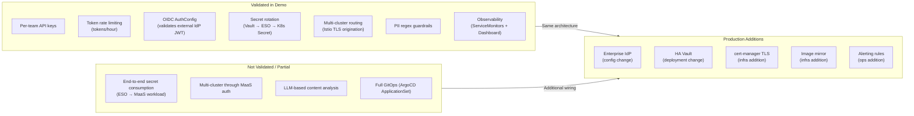

# Gaps & Production Considerations

This document outlines the differences between this demo environment and a production deployment.

---

## Demo vs Production

| Area | Demo Environment | Production Target | Gap |
|------|------------------|-------------------|-----|
| Deployment method | Scripts with imperative `oc apply` ordering | ArgoCD ApplicationSets with Kustomize overlays | Kustomize profiles provided but untested in CI; scripts ensure correct order |
| Network | Connected (public internet) | Disconnected (internal registry mirror) | Images pulled from registry.redhat.io; production needs mirror config |
| TLS | Self-signed certs on MaaS gateway | cert-manager with proper CA | Production needs valid certificates |
| Auth enforcement | May be in permissive mode initially | Strict (all requests require valid key/token) | MaaS controller tightens policy once subscriptions are reconciled |
| Identity Provider | External OIDC provider (bring your own) | Enterprise IdP (Okta/Azure AD/ADFS) | Config change only — AuthConfig issuerUrl points to customer IdP |
| Vault secrets | ESO syncs to K8s Secrets (not consumed by MaaS) | Secrets mounted into relevant workloads | Demonstrates rotation pattern; wiring is environment-specific |
| Vault mode | Dev mode (in-memory, ephemeral) | Production HA Vault with persistent storage | Architecture identical; only deployment mode differs |
| Rate limiting | Configured in manifests (tokens/hour) | Enforced with real traffic patterns | Limitador counters active; production tuning needed for actual values |
| Multi-cluster | AI Gateway on gateway cluster routes to model on inference cluster (bypasses MaaS auth) | Route through MaaS for unified auth on all paths | Demo proves connectivity; production adds auth on multi-cluster path |
| Observability | Prometheus + ServiceMonitors + Dashboard ConfigMap | Grafana/Perses dashboards + alerting + federation | Dashboard JSON ready; needs Grafana instance and alert rules |
| Guardrails | Regex-based PII detection only | LLM-powered content analysis + TrustyAI | Demo proves architecture pattern; production adds ML-based detectors |
| API management | Direct access to AI Bridge | End users → API Gateway (e.g., Apigee) → AI Bridge → Model | Architecture validated; API gateway just points to AI Bridge URL |
| GPU | GPUs on both clusters (demo scale) | NVIDIA A100/H100 (production scale) | Model serving pattern identical; only GPU type/count changes |

---

## What This Architecture Proves

---

## Key Findings

1. **The AI Bridge complements existing API management** — it handles model-aware governance that generic API gateways cannot: per-subscription token metering, inference-specific rate limiting, and model routing

2. **Per-use-case isolation works today** — each team gets independent API keys, rate limits, and usage tracking without shared credentials

3. **Token-based rate limiting prevents noisy-neighbor problems** — burst load from one team cannot degrade service for others (enforced at tokens/hour granularity)

4. **Enterprise identity federation architecture is ready** — AuthConfig validates JWT from any OIDC provider; requires only an issuer URL change per environment

5. **Secret rotation infrastructure demonstrated** — ESO syncs credentials from Vault automatically within 30 seconds; mounting into workloads is environment-specific wiring

6. **Content safety can be layered inline** — guardrails gateway inspects traffic without changing the model; current regex-based detection extensible to LLM-based analysis

7. **Multi-cluster routing proves connectivity** — Istio gateway with TLS origination routes to remote model; production should add MaaS auth on this path too

8. **Deployment is scripted and repeatable** — `deploy-all.sh` deploys the full stack in correct order; Kustomize profiles available for ArgoCD adoption

---

## Migration Path to Production

| Step | Action | Effort |
|------|--------|--------|
| 1 | Mirror container images to internal registry | Low |
| 2 | Configure cert-manager for TLS certificates | Low |
| 3 | Point OIDC AuthConfig to enterprise IdP | Low (config change) |
| 4 | Mount ESO-synced secrets into MaaS/PG workloads | Low-Medium |
| 5 | Route multi-cluster traffic through MaaS auth | Medium |
| 6 | Deploy production Vault (HA mode) | Medium |
| 7 | Tune rate limits for actual traffic patterns | Medium |
| 8 | Set up Grafana with alert rules | Medium |
| 9 | Add LLM-based guardrails (TrustyAI) | Medium |
| 10 | Adopt ArgoCD ApplicationSets for full GitOps | Medium |
| 11 | Configure cross-site networking for multi-cluster | Medium-High |
| 12 | Integrate with existing API gateway (e.g., Apigee) | Low (URL change) |
